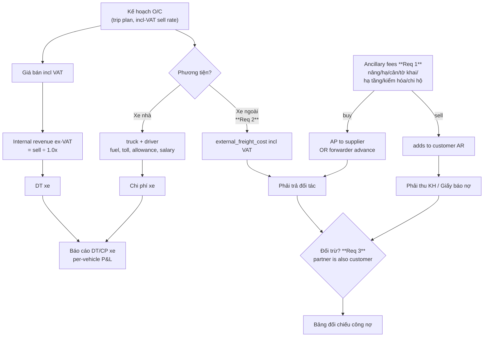

# Implementation Plan (Revised): Service Costs, External Carrier & Debt Netting

**Source documents reconciled:**
1. Customer requirements from Pete (01/06/2026) — the three requested features.
2. *Quy trình vận hành và quản lý vận chuyển tại Công ty TNHH NePO* — the formal operating procedure (authoritative).
3. Business-flow sketch (Kế hoạch O/C → DT xe / Phải thu KH / Chi phí xe / Phải trả đối tác → Báo cáo DT/CP xe).

**Status:** Revised draft — supersedes `PLAN_service_costs_external_carrier_netting.md`. **All open questions resolved by customer (NePoQA, 02/06/2026)** — see §8. Ready for build.

---

## 0. What changed vs the original draft (read this first)

The original plan scoped the three features correctly but treated them as if the only new data were buy/sell amounts and a carrier toggle. The operating procedure shows the features sit inside a richer process. These are the substantive deltas folded into this revision:

| # | Change | Evidence | Where |
|---|--------|----------|-------|
| D1 | **VAT must be modelled.** Sell freight is entered *incl. VAT*; internal accounting revenue = sell ÷ (1 + rate) (1.08 @ 8%, 1.10 @ 10%); external freight is entered *incl. VAT*. P&L (DT xe) must use the ex-VAT figure. | Procedure §1 | §2.1, §4 |
| D2 | **Ancillary fees carry invoice metadata.** Each fee needs invoice no. + invoice date; customs needs declaration no.; all linked to container no. The draft schema only added buy/sell/supplier. | Procedure §2 | §3 |
| D3 | **Buy-side settlement has two paths**, not one. Some fees are paid *by the company directly to the supplier* (→ AP), others are *paid by the forwarder from an advance* (chi hộ → reconciled via phiếu thanh toán). The draft only models AP-to-supplier. | Procedure §2 | §3, §8 Q-A |
| D4 | **Sell-side output is a formal debit note (giấy báo nợ)**, not just a P&L line — freight + selected ancillary services, exported in company form. | Procedure §3 (monthly) | §3 |
| D5 | **Reporting is per-vehicle and container-centric.** Service margin + external margin must roll into *Báo cáo doanh thu/chi phí theo từng xe*; container number is the central retrieval key. | Procedure §5, sketch | §6 |
| D6 | **Approval states are pervasive**, not just a netting question — manager approves accountant entries; forwarder edits to yellow fields need approval. Offsets should fit the same pattern. | Procedure §2, §3 | §2.3, §5 |

Everything in §3–§5 below is the original plan's structure, corrected for the above.

---

## 1. The three features in their process context



- **Req 1 (Chi phí dịch vụ đi kèm)** lives in the forwarder data-entry step (§2 of the procedure) and feeds both the giấy báo nợ (sell) and advance reconciliation / supplier AP (buy).
- **Req 2 (Điều động xe ngoài)** lives in the planning step (§1) — the internal-vs-external assignment, with VAT-aware rate entry.
- **Req 3 (Đối trừ công nợ)** lives in the monthly reconciliation step (§5) — net AR against AP for dual-role partners.

---

## 2. Cross-cutting prerequisites (land before / alongside P1)

### 2.1 VAT model (new — required by D1)

Add VAT to the trip so internal P&L is ex-VAT while AR is incl-VAT.

```sql
ALTER TABLE trips
  ADD COLUMN vat_rate NUMERIC(4,3) NOT NULL DEFAULT 0.080;  -- 0.080 | 0.100
-- customer_freight is stored INCL VAT (as entered).
-- ex-VAT revenue is derived: customer_freight / (1 + vat_rate)
```

Decide once: store `vat_rate` per trip (flexible, matches procedure wording) vs derive from customer/route defaults. Recommend per-trip with a customer-level default to prefill.

`shared/src/calculations/tripTotals.ts` — add a single source of truth:
```ts
const freightExVat = round0(customerFreightInclVat / (1 + vatRate));
// freightExVat feeds DT xe and per-vehicle P&L; customerFreightInclVat feeds AR.
```

### 2.2 Container-number-centric retrieval (D5)

Procedure §5 makes container number the primary lookup key. You don't need to re-key the schema, but ensure: `containerNumber` is indexed on trips/expenses, and the global search + every list filter accepts it. Add `CREATE INDEX trips_container_idx ON trips(container_number);` if absent.

### 2.3 Approval state (D6)

All three features post to the ledger; the procedure gates accountant/forwarder edits behind manager/director approval. Reuse one mechanism rather than inventing per-feature flows. If a generic `approval_status` (`DRAFT | PENDING | APPROVED | REJECTED`) + `approved_by` pattern doesn't already exist on financial records, introduce it now and apply it to: ancillary-fee edits to "yellow" fields, the phiếu thanh toán, and debt offsets (§5).

---

## 3. Requirement 1 — Chi phí dịch vụ đi kèm (revised)

### Business logic
Each ancillary fee has a **buy** (mua vào — company pays port/supplier) and a **sell** (bán ra — billed to customer on the giấy báo nợ); margin = sell − buy. **Two corrections vs the draft:**

- **D2 — metadata:** every fee needs invoice no. + invoice date; customs needs a declaration no.; "chi hộ khác" needs a free-text detail. These are required by §2 and used on the giấy báo nợ and for advance reconciliation.
- **D3 — settlement path:** the buy side is *not always* an AP to a named supplier. Per §2 the forwarder frequently pays at the port from a cash advance (chi hộ), then files a phiếu thanh toán. So a fee is settled either **COMPANY_DIRECT** (→ supplier AP) or **FORWARDER_ADVANCE** (→ reduces the forwarder's advance balance, no supplier AP). The ledger posting must branch on this.

### Fee taxonomy (from procedure §2 + NePoQA markup rules)
| Code | Vietnamese | Required extra fields | Settlement default | Sell default |
|------|-----------|------------------------|--------------------|--------------|
| `LIFTING` | Phí nâng container | invoice no., invoice date | advance (or direct if >5M / shipping-line invoice) | **at cost** |
| `LOWERING` | Phí hạ container | invoice no., invoice date | advance / direct | **at cost** |
| `WEIGHING` | Phí cân hàng | invoice no., invoice date | advance / direct | **at cost** |
| `CUSTOMS` | Phí làm tờ khai hải quan | declaration no., container no. | advance / direct | **markup** (mgmt fee/tax added) |
| `INFRASTRUCTURE` | Phí kết cấu hạ tầng (nộp hộ) | per container | advance (state, no vendor) | **at cost** |
| `INSPECTION` | Phí kiểm hóa tại cảng | invoice no., invoice date | advance / direct | **at cost** |
| `INSPECTION_SVC` | Phí phục vụ kiểm hóa | detail text | advance / direct | **markup** |
| `OTHER` | Phí chi hộ khác | detail text, container no. | advance / direct | per case (may be internal-only) |

> Settlement rule (NePoQA): default `FORWARDER_ADVANCE`; switch to `COMPANY_DIRECT` when the fee is **paid to the shipping line with a NePO invoice** or **> 5,000,000 VND** (NePO bank transfer). "At cost" vs "markup" drives the **sell-price prefill only** — the accountant can always edit. Some fees are **internal-only** (not billed, or billed under a different label) → sell may be 0 with an optional billing label. Consider a `default_markup` flag + optional `billing_label` on `forwarder_expense_types` to drive prefills.

### DB changes (expanded vs draft)
```sql
ALTER TABLE trip_expenses
  ADD COLUMN buy_amount        NUMERIC(15,0),               -- migrate from existing `amount`
  ADD COLUMN sell_amount       NUMERIC(15,0) DEFAULT 0,
  ADD COLUMN supplier_id       INTEGER REFERENCES suppliers(id),   -- nullable
  ADD COLUMN settlement_method VARCHAR(20) NOT NULL DEFAULT 'COMPANY_DIRECT', -- 'COMPANY_DIRECT' | 'FORWARDER_ADVANCE'
  ADD COLUMN invoice_number    VARCHAR(50),
  ADD COLUMN invoice_date      DATE,
  ADD COLUMN declaration_number VARCHAR(50),                -- customs
  ADD COLUMN container_number  VARCHAR(20);                 -- redundant-but-indexed for §5 lookup
-- Migration: amount -> buy_amount; sell_amount = 0; settlement_method defaulted; backfill container_number from trip.
```
`forwarder_expense_types` — no change to existing codes; confirm all seven taxonomy codes above exist.

### Backend
- `TripExpense` type: add `buyCost`, `sellPrice`, `supplierId`, `settlementMethod`, `invoiceNumber`, `invoiceDate`, `declarationNumber`.
- `computeTripTotals()`: `totalServiceBuy`, `totalServiceSell`, `serviceMargin = sell − buy`; include `totalServiceSell` in gross revenue, `totalServiceBuy` in costs.
- `lockTrip()` — branch per expense:
  - `COMPANY_DIRECT` + `supplierId` → `VENDOR_EXPENSE` debit on that supplier's ledger (AP).
  - `FORWARDER_ADVANCE` → post against the forwarder advance account (reduces remaining advance); **do not** create supplier AP. *(This is the integration point with the tạm ứng/hoàn ứng subsystem — see §8 Q-A.)*
  - sell side always increases customer AR.
- Validation: customs requires `declarationNumber`; invoice-bearing types require `invoiceNumber` + `invoiceDate` before the fee can be locked / put on a giấy báo nợ.

### Frontend
- Trip expenses grid: columns **Mua vào**, **Bán ra**, **Lãi DV** (sell − buy), **Nhà cung cấp** (dropdown, optional), **Hình thức chi** (COMPANY_DIRECT / FORWARDER_ADVANCE toggle), plus invoice no./date and declaration no. fields shown conditionally by fee type.
- `TripDetailPage`: read-only grid with buy/sell/margin; add `totalServiceSell` to the revenue card.
- **Giấy báo nợ (D4):** an accountant action that selects freight + ancillary *sell* lines for a customer and exports the company-form debit note. **Two modes, selected per customer** (add `debit_note_mode = 'MONTHLY' | 'PER_BATCH'` on the customer): **monthly** for customers doing only road + ancillary; **per-shipment (theo lô)** for customers doing road + sea + ancillary. The note is **itemized** — freight and each ancillary fee on its own line, never consolidated. This is the primary sell-side deliverable of Req 1 — build the selection + export for both modes.

---

## 4. Requirement 2 — Điều động xe ngoài (revised)

### Business logic
A trip is fulfilled by **xe nhà** (own truck) or **xe ngoài** (external partner). Customer pays the normal incl-VAT freight either way; for xe ngoài, NePO pays the partner the external freight and keeps the management margin.

**Correction (D1):** the procedure §1 ties VAT handling to this step. For **xe nhà**, capture/derive the *internal accounting rate ex-VAT* (= sell ÷ 1.0x) — that's the revenue for the vehicle P&L. For **xe ngoài**, the external freight is entered *incl VAT* and becomes the partner AP.

### DB changes
```sql
ALTER TABLE trips
  ADD COLUMN carrier_type          VARCHAR(20) NOT NULL DEFAULT 'OWN',  -- 'OWN' | 'EXTERNAL'
  ADD COLUMN external_carrier_id   INTEGER REFERENCES suppliers(id),    -- nullable
  ADD COLUMN external_freight_cost NUMERIC(15,0),                       -- giá cước thuê ngoài, INCL VAT
  ADD COLUMN external_plate_number VARCHAR(20),    -- biển số xe ngoài (needed to issue freight invoice)
  ADD COLUMN external_driver_name  VARCHAR(100),   -- tên lái xe (given to customer)
  ADD COLUMN external_driver_phone VARCHAR(20);    -- SĐT lái xe (given to customer)
-- vat_rate already added in §2.1 — used to derive ex-VAT revenue for OWN trips.
```
Constraints: `OWN` → `truck_id` + `driver_id` required (existing). `EXTERNAL` → `external_carrier_id` + `external_freight_cost` + `external_plate_number` required; `external_driver_name` / `external_driver_phone` strongly recommended (given to customer); `truck_id`/`driver_id` nullable. Migration defaults existing rows to `OWN`.

`txn_type` enum: add `EXTERNAL_CARRIER_COST` (or reuse `VENDOR_EXPENSE`).

### Backend
- `Trip` type + Zod schema: add `carrierType`, `externalCarrierId`, `externalFreightCost`; conditional validation as above.
- `lockTrip()` (EXTERNAL): post `VENDOR_EXPENSE` against `externalCarrierId` for `externalFreightCost` (AP); `externalMargin = freightExVat − externalFreightCostExVat` flows to P&L as management-fee income. *(Note: if you compare incl-VAT customer freight to incl-VAT external cost the margin is overstated by the VAT delta — compare like-for-like. Decide the convention in §8 Q-B.)*
- `computeTripTotals()` (EXTERNAL): `totalCost` = `externalFreightCost` only (no fuel/allowance/driver salary); add `externalMargin`.

### Frontend
- Trip form: **carrier-type toggle** (Xe nhà | Xe ngoài). Xe nhà → existing Truck/Driver dropdowns. Xe ngoài → hide them; show **Đối tác vận chuyển** (supplier dropdown, ideally filtered to `category='CARRIER'`) + **Giá cước mua vào (gồm VAT)** + **Biển số xe** + **Tên lái xe** + **SĐT lái xe** (plate/driver captured for invoicing & to pass to customer) + read-only **Lãi điều xe ngoài** preview.
- `TripDetailPage`: "Xe ngoài" section (partner, plate, driver name/phone, external cost, management margin) when `carrierType='EXTERNAL'`.
- Dispatch board: badge/icon to distinguish xe ngoài.
- External-carrier AP appears on the Công nợ phải trả page automatically via the ledger.

---

## 5. Requirement 3 — Đối trừ công nợ (revised)

### Business logic
Entity X can be both a `customer` (AR) and a `supplier/carrier` (AP) because partners ship for each other. **Đối trừ** records a mutual offset that reduces both AR and AP with no cash movement; net = AR − AP after offset. The procedure §5 calls the output a **bảng đối chiếu công nợ**.

**Customer rules (NePoQA):** offset is **monthly**, prepared by the accountant, **approved by manager before issuing**, and **always done in full, once** — the entire smaller of the two balances is cleared in a single entry. **There is no partial offset and no free-entry amount**: the offset amount is fixed at `min(arBalance, apBalance)`. How the two parties settle the remaining cash is out of scope.

### DB changes
```sql
ALTER TABLE suppliers ADD COLUMN linked_customer_id INTEGER REFERENCES customers(id);
ALTER TABLE customers ADD COLUMN linked_supplier_id INTEGER REFERENCES suppliers(id);

CREATE TABLE debt_offsets (
  id          SERIAL PRIMARY KEY,
  customer_id INTEGER NOT NULL REFERENCES customers(id),
  supplier_id INTEGER NOT NULL REFERENCES suppliers(id),
  amount      NUMERIC(15,0) NOT NULL,
  offset_date DATE NOT NULL,
  note        TEXT,
  approval_status VARCHAR(20) NOT NULL DEFAULT 'PENDING',  -- D6: reuse §2.3 states
  created_by  INTEGER REFERENCES users(id),
  approved_by INTEGER REFERENCES users(id),
  created_at  TIMESTAMP NOT NULL DEFAULT NOW()
);
CREATE INDEX debt_offsets_customer_idx ON debt_offsets(customer_id);
CREATE INDEX debt_offsets_supplier_idx ON debt_offsets(supplier_id);
```
Ledger on **approval** (not creation, per D6): `ADJUSTMENT` debit on customer ledger (reduces AR), `ADJUSTMENT` credit on supplier ledger (reduces AP).

### Backend
- `GET /finance/dual-entities` → customers with `linked_supplier_id` (and vice-versa) with `arBalance`, `apBalance`, `netBalance`.
- `POST /finance/debt-offsets` → amount is **server-computed** as `min(arBalance, apBalance)` (client does not send a free amount); insert row (`PENDING`); ledger posts only on approval. One offset per customer–supplier pair per month.
- `POST /finance/debt-offsets/:id/approve` → posts the two ledger entries (manager/director).
- `GET /finance/debt-offsets?customerId&supplierId` → history.
- `customers/:id/ledger` → include `offsetAmount` so AR aging reflects net.

### Frontend
- Supplier management: "Liên kết khách hàng" dropdown → `linked_customer_id`.
- `DebtListPage`: "Đối tác 2 chiều" badge + "Net công nợ" column for dual-role entities; link to offset modal.
- `DebtDetailPage`: when linked, show a "Công nợ phải trả" card for the linked supplier + "Đối trừ" button.
- **Offset modal:** shows phải thu / phải trả / **the computed full-offset amount** = `min(AR, AP)` (read-only, not an editable input); inputs date + note only; submits `PENDING`; on success refreshes both balances and shows pending-approval state.
- **Bảng đối chiếu công nợ:** a reconciliation view/export per pair (or per period) listing AR, AP, offsets, and net — this is the §5 deliverable.

---

## 6. How it rolls up — per-vehicle P&L (Báo cáo DT/CP xe)

The sketch's endpoint and procedure §5 both demand revenue/cost **per vehicle, per period**. Ensure both new margins feed it:

- Revenue (per vehicle): `freightExVat` (own trips) **+** `serviceMargin` (Req 1) **+** `externalMargin` (Req 2, management fee).
- Cost (per vehicle): fuel + toll + road allowance + combined salary + repairs/parts + `totalServiceBuy` (when company-direct) — and for external trips, the external freight in place of own-truck costs.
- Add report lines: **"Lãi dịch vụ đi kèm"** and **"Doanh thu điều xe ngoài (lãi quản lý)"** so the P&L explains the new numbers.
- Group by `truck_id`; for xe ngoài, group under the external partner (or a dedicated "Xe ngoài" bucket) since there's no own `truck_id`.

---

## 7. Implementation order (revised)

| Phase | Work | Notes |
|-------|------|-------|
| **P0** | §2 prerequisites: VAT model, container index, approval-status mechanism | Unblocks correct numbers everywhere; cheap, do first |
| **P1** | DB migrations for all three features (incl. D2/D3 columns) | Schema-first; parallelizes backend/frontend |
| **P2a** | Req 1 backend: buy/sell + invoice metadata + **settlement-method branch** in `lockTrip` | Highest daily impact; depends on §8 Q-A |
| **P2b** | Req 2 backend: external carrier + VAT-aware margin | Needed before next external dispatch |
| **P2c** | Req 3 backend: dual-entities, offsets, **approve endpoint** | Less urgent |
| **P3a** | Req 1 frontend: expenses grid (metadata + settlement toggle) | Paired with P2a |
| **P3b** | Req 2 frontend: carrier toggle | Paired with P2b |
| **P3c** | Req 3 frontend: offset modal + dual badges + đối chiếu view | Paired with P2c |
| **P4** | **Giấy báo nợ** export (freight + ancillary sell) | D4 — the sell-side deliverable |
| **P5** | Per-vehicle P&L lines (service margin, external margin) | §6 — ties it together |
| **P6** | Integration tests + migration rollback plan | Before production |

(Advance/hoàn-ứng tracking from §2 of the procedure is its own subsystem; Req 1's buy side *interfaces* with it via `FORWARDER_ADVANCE`. **NePoQA confirms forwarder advances are real and used for most ancillary fees**, so this posting path is required — if the advance subsystem doesn't exist yet, P2a needs at minimum a forwarder-advance account to post against.)

---

## 8. Decisions — RESOLVED by customer (NePoQA, 02/06/2026)

All open questions are now answered. Decisions and their implementation impact:

**Req 1 — Ancillary services**
- **Settlement path** → *Mostly* `FORWARDER_ADVANCE` (forwarder pays from advance, reconciles later). Exception → `COMPANY_DIRECT` when the fee is **paid to the shipping line with an invoice issued to NePO** *or* **the amount is over 5,000,000 VND** (paid by NePO bank transfer). **Implementation:** keep both settlement methods; default to `FORWARDER_ADVANCE`; the >5M / shipping-line-invoice cases switch to `COMPANY_DIRECT`. This is a *suggestion/default*, not a hard rule — the user can override per fee.
- **Sell price** → Based on NePO's quote: some fees rebilled at cost, some with markup. **The accountant must be able to type/edit the sell price**, pre-filled from buy cost but freely editable. (Confirms the editable "Bán ra" column — it is not auto-computed.)
- **Markup rules (which fees keep cost vs add margin):**
  | Fee | Sell rule |
  |-----|-----------|
  | Phí kết cấu hạ tầng | **At cost** (no markup) |
  | Phí nâng/hạ container | **At cost** |
  | Phí kiểm hóa tại cảng | **At cost** |
  | Phí cân hàng | **At cost** |
  | Phí thủ tục hải quan | **Markup** (management fee / tax added) |
  | Phí phục vụ kiểm hóa | **Markup** |
  This is guidance for a *default/prefill*, not a lock — the user can still edit. Consider a per-fee-type `default_markup` flag in `forwarder_expense_types` to drive the prefill (cost vs editable-with-margin), but always allow override.
- **Internal-only fees** → Yes, some fees are real costs to the forwarder that are **not billed to the customer, or billed under a different line item.** **Implementation:** sell price may be 0 (internal cost only), and the fee's billed *category/label* on the giấy báo nợ can differ from its internal type. Add an optional "billing label / không xuất cho khách" treatment on the sell side.
- **VAT on ancillary sell** → Yes — **all fees bear VAT 8%** (current rate; may rise to 10% later). VAT must be a configurable rate, not hard-coded.

**Req 2 — External carrier**
- **External driver/vehicle info** → *Resolved (richer than assumed):* NePO **does** need, for xe ngoài: **vehicle plate number** (for issuing the freight invoice), **driver name**, and **driver phone** (to give to the customer). **Implementation:** add `external_plate_number`, `external_driver_name`, `external_driver_phone` to the trip when `carrier_type='EXTERNAL'`. *(This supersedes the earlier "partner company only" assumption.)*
- **Management fee** → Natural margin only (sell − buy); **varies per trip**, no fixed %, no formula, differs by customer/partner. **Implementation:** do **not** build a configurable %; just compute the difference. (Closes carried Q2.)
- **Margin VAT convention** → **Compute the margin ex-VAT** ("quy về mức chưa gồm thuế VAT"). **Implementation:** `externalMargin = (customerFreight / (1+vat)) − (externalFreightCost / (1+vat))`. Resolves Q-B in favour of the ex-VAT approach already noted in §4.

**Req 3 — Debt netting**
- **Cadence & owner** → Monthly, performed by NePO accountant.
- **Approval** → Accountant prepares; **manager reviews and approves before issuing.** Confirms the `PENDING → APPROVED` flow in §5 (closes Q4 = yes).
- **Partial netting** → **No.** The offset is done **in full, once per month** — the entire smaller balance is cleared in a single entry; how the two parties then settle cash is out of scope. **Implementation:** *simplifies* §5 — the offset amount is fixed at `min(arBalance, apBalance)`, **not** a free-entry amount. Drop the editable-amount input; show the computed full-offset amount. (Reverses the earlier "assumed partial allowed" — Q5 resolved as full-only.)

**VAT (general)**
- Current rate **8%**, may become **10%** by tax-authority change. **Implementation:** store as a configurable rate (a system/company default that can change over time), applied per trip. Confirms §2.1.

**Giấy báo nợ (debit note)**
- **Granularity** → Depends on the customer: **monthly** for customers doing only road transport + ancillary services; **per-shipment (theo lô)** for customers doing road + sea + ancillary. **Implementation:** the debit-note generator must support **both modes**, selectable per customer (add a `debit_note_mode` = `MONTHLY | PER_BATCH` on the customer).
- **Line detail** → **Itemized** — each service on its own line, not consolidated. **Implementation:** debit note renders freight + each ancillary fee as separate lines.

> **Net effect on the plan:** Req 1 and Req 2 gain a few fields (external plate/driver/phone; per-fee markup default; billing label); the VAT-ex-VAT margin and editable sell price were already in the design. Req 3 gets **simpler** (full-offset only, fixed amount). The giấy báo nợ needs **two granularity modes**. Nothing is blocked anymore — the advance subsystem question (old Q-A) is also answered: forwarder advances are real and used for most fees, so the `FORWARDER_ADVANCE` posting path **must** exist (see §3 / §10).

---

## 9. Affected files

```
DB migrations
  backend/src/db/migrations/XXXX_vat_container_approval.sql            (P0)
  backend/src/db/migrations/XXXX_service_costs_external_carrier_netting.sql  (P1)

Schema
  backend/src/db/schema.ts          (trips +vat_rate +carrier fields +external_plate/driver/phone; trip_expenses +buy/sell/supplier/settlement/invoice/declaration/container; forwarder_expense_types +default_markup +billing_label; customers +debit_note_mode +linked_supplier_id; suppliers +linked_customer_id; debt_offsets)

Shared
  shared/src/types/index.ts         (Trip, TripExpense, DebtOffset)
  shared/src/schemas/index.ts       (trip create/update w/ conditional carrier + VAT; expense schema w/ metadata)
  shared/src/calculations/tripTotals.ts   (freightExVat, serviceMargin, externalMargin)

Backend
  backend/src/services/trip.service.ts     (lockTrip branch by settlement_method & carrier_type, createExpense, updateExpense)
  backend/src/routes/trips.ts              (expense endpoints + metadata)
  backend/src/routes/financial.ts          (dual-entities, debt-offsets, offset approve, giấy báo nợ export)

Frontend
  frontend/src/pages/TripCreatePage.tsx
  frontend/src/pages/TripEditPage.tsx
  frontend/src/pages/TripDetailPage.tsx
  frontend/src/pages/DebtListPage.tsx
  frontend/src/pages/DebtDetailPage.tsx
  frontend/src/pages/FinancePage.tsx               (per-vehicle P&L lines; bảng đối chiếu)
  frontend/src/components/DebtOffsetModal.tsx       (new)
  frontend/src/components/DebitNoteExport.tsx       (new — giấy báo nợ)
  frontend/src/api/tripClient.ts                    (new API calls)
```
