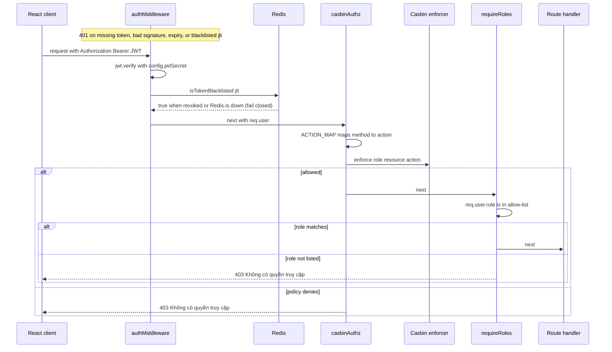

NEPO uses a two-layer authorization model. Layer 1 verifies the JWT bearer token
(Layer 1a) and re-checks its `jti` against the Redis blacklist (Layer 1b) — the
same check runs in `authMiddleware` for HTTP and in the socket.io handshake for
the assistant socket. Layer 2 applies Casbin's resource-level policy, optionally
tightened by a per-route role allow-list. Every mutation also flows through the
audit middleware, which writes a Vietnamese-language row regardless of how many
tables the handler touches.

## Login & token lifecycle

1. **Client** `POST /api/auth/login` with `{ identifier, password }` validated by
   `loginSchema` from `@tingting/shared`. The identifier may be a username,
   email, **or phone number** — `userService.authenticate` matches
   `username OR email OR phone`.
2. **Backend** `backend/src/routes/auth.ts` calls
   `backend/src/services/user.service.ts#authenticate`, which rejects
   soft-deleted or non-`ACTIVE` accounts and verifies the bcrypt hash. Any
   failure returns the generic 401 `Thông tin đăng nhập không hợp lệ` (no
   account-existence oracle).
3. The route signs a JWT with `{ userId, username, email, fullName, role, jti }`
   (`jti = crypto.randomUUID()`) using `config.jwtSecret`
   (`JWT_SECRET`, min 32 chars in production) and `config.jwtExpiresIn`
   (default `7d`). The response also carries `capabilities` (see
   [Capability derivation](#capability-derivation)) and `botEnabled` from app
   settings.
4. The browser stores the token in `localStorage` under the key `token` via
   `frontend/src/design-system/hooks/useToken.ts` (the only file that touches
   the storage key); the React `AuthProvider` (`frontend/src/hooks/useAuth.tsx`)
   rehydrates the user with `GET /api/auth/me` on page load. `/auth/me` compares
   the token's role to the current DB role and throws 401
   `Vai trò đã thay đổi, vui lòng đăng nhập lại` on drift — a role downgrade
   takes effect at the next `/me` poll, not just at token expiry.
5. Subsequent requests attach `Authorization: Bearer <token>`; the API client
   (`frontend/src/lib/api/client.ts`) does this for every fetch.

**Revocation.** `POST /api/auth/logout` and `POST /api/auth/change-password`
call `blacklistCurrentToken` (`backend/src/routes/auth.ts:27`): decode the token
without verifying, then `blacklistToken(jti, ttl)` writes `blacklist:<jti>` to
Redis with `EX` = remaining seconds until `exp`, so the entry self-expires when
the token would have anyway. `isTokenBlacklisted`
(`backend/src/lib/redis.ts:122`) is **fail-closed**: if Redis errors, it returns
`true`, rejecting potentially-revoked tokens rather than admitting them.

### `authMiddleware` (`backend/src/middleware/auth.ts:25`)

- Strips `Bearer ` from the `Authorization` header.
- Calls `jwt.verify(token, config.jwtSecret)`.
- If the payload includes a `jti`, checks `isTokenBlacklisted(jti)` against Redis.
- On any failure returns 401 with a Vietnamese message
  (`Token không hợp lệ` / `Token đã bị thu hồi` / `Token hết hạn hoặc không hợp lệ`).
- On success attaches `req.user = payload` for downstream middleware.

`assetAuthMiddleware` (`backend/src/middleware/auth.ts:46`) is a sibling used by
`/api/photos` so that `` tags can pass the token via `?token=…` (browsers
cannot set `Authorization` headers on image loads; see
`getAuthenticatedPhotoUrl` in `frontend/src/lib/api/photo.ts`). The comment is
explicit: "scoped narrowly to avoid exposing tokens in URL logs/Referer on
general API routes."

`getUser(req)` (`backend/src/middleware/auth.ts:69`) is the type-safe accessor
handlers use; it throws `ApiError(401, 'Chưa xác thực')` if a route is ever
reorganized out from behind `authMiddleware`.

## Socket.io handshake — same auth surface

The assistant's real-time transport (`backend/src/agentSocket.ts`) does not get
a free pass: `registerAuth` (`agentSocket.ts:112`) runs as a namespace middleware
on `/agent` **before** the `connection` event fires:

1. Reads the token from `socket.handshake.auth.token`.
2. `jwt.verify` with `config.jwtSecret`, then the same `isTokenBlacklisted(jti)`
   check — an invalidated (logged-out) token cannot open a socket either.
3. On success stores `socket.data.user = payload`; on failure rejects with the
   same three Vietnamese messages as `authMiddleware`.

Handshake auth is necessary but not sufficient: at `connection` the handler
re-checks the office-role gate (`OFFICE_ROLES = [ADMIN, MANAGER, ACCOUNTANT]`,
mirroring the Casbin `agent` policy) plus the DB-backed `botEnabled` switch, and
every `agent:chat` message re-checks `botEnabled` so a socket that connected
before an admin disabled the bot cannot keep using it. The client
(`frontend/src/api/agentClient.ts:96`) sends `auth: { token }` and discards its
cached socket whenever the token changes, forcing a fresh handshake after
logout/re-login.



*One authenticated request through the two-layer gate: JWT + blacklist, then
Casbin resource policy, then an optional role allow-list. The socket.io
handshake runs the first layer identically before any `connection` fires.*

## Roles

| Role | Vietnamese (`ROLE_LABELS`) | Casbin grants (`policy.csv`) |
|---|---|---|
| `ADMIN` | Quản trị viên | `p, ADMIN, *, *` wildcard (plus redundant explicit `audit_logs`/`salary` rows) |
| `MANAGER` | Quản lý | trips/config/financial/users read+write+delete; audit_logs, maps, photos, salary read; upload, gps-admin, ocr write; notifications, agent read+write |
| `ACCOUNTANT` | Kế toán | trips read+write; config read+write+delete; financial read+write+delete; users read+write; audit_logs, maps, photos read; upload, ocr write; notifications, agent read+write; salary read+write |
| `DRIVER` | Lái xe | `driver_portal` read+write+delete (own trips/earnings/penalties/containers); maps, photos, salary read; notifications read+write; ocr write |
| `FORWARDER` | Giao nhận | `forwarder_portal` read+write+delete (own trip expenses, advances, settlements); maps, photos read; notifications read+write |

The enum and its Vietnamese labels live side by side in
`shared/src/constants/index.ts` (`Role`, `ROLE_LABELS`). The same file exports
`FINANCIAL_ROLES = [ADMIN, MANAGER, ACCOUNTANT]` and the `isFinancialRole`
helper, which the notification service uses as a push-audience filter
(`audience === 'financial' && isFinancialRole(t.role)`). Roles are the Casbin
subjects in `policy.csv` **and** the values the React route guards compare — one
enum, three consumers, so a new role must update all three.

## Casbin model & policy

The model (`backend/src/casbin/model.conf`) is a plain ACL: subject = role
string, object = resource name, action = verb. The matcher is exact equality on
subject with wildcard support only on object/action —

```
m = r.sub == p.sub && (p.obj == "*" || r.obj == p.obj) && (p.act == "*" || r.act == p.act)
```

— so there is **no subject wildcard and no role hierarchy**; every role must
have its own rows. `p, ADMIN, *, *` is the single wildcard grant.

`enforcer.enforce(sub, resource, act)` returns a boolean; `false` → 403
(`Không có quyền truy cập`), a thrown enforcer error → 500 (`Lỗi kiểm tra quyền`).

**Reload caveat:** `initEnforcer()` (`backend/src/casbin/enforcer.ts:12`) reads
`model.conf` + `policy.csv` exactly once, awaited at the top of
`backend/src/index.ts` before the app starts. There is no reload API and no
policy watcher: editing `policy.csv` requires a process restart. Under
`tsx watch` the process only restarts when a *source file* changes, so a
policy-only edit is picked up on the next deploy/restart, not on save (the
comment in `enforcer.ts` suggests a no-op edit to `enforcer.ts` to force a
dev reload).

### Capability derivation

`getCapabilities(role)` (`backend/src/services/user.service.ts:375`) reuses the
live enforcer to derive a frontend-facing capability list: `manage_users` is
pushed when `enforce(role, 'users', 'write')` is true **and** the role is not
ACCOUNTANT (accountants get scoped driver-edit rights via policy but must not
see full management UI). This is the only place Casbin output leaks to the
client as data; it is a UI hint, not an authorization decision.

## Dual-layer pattern & mount order

Coarse-grained resource access uses `casbinAuthz('resource')` at the route mount
point; fine-grained endpoint gating uses `requireRoles(...)` inside the router or
as a second mount middleware.

```ts
// backend/src/index.ts — llm-settings has no policy row, so casbinAuthz would
// already be ADMIN-only; requireRoles makes that intent explicit.
app.use(
  '/api/admin/llm-settings',
  authMiddleware,
  casbinAuthz('llm-settings'),     // no policy row → ADMIN-only
  requireRoles(Role.ADMIN),         // belt-and-suspenders
  llmSettingsRoutes,
);
```

```ts
// backend/src/routes/financial/advances.routes.ts — endpoint-level role gate
router.post(
  '/advance-requests/:id/approve',
  requireRoles(Role.ADMIN, Role.MANAGER),
  asyncHandler(async (req, res) => { ... }),
);
```

`requireRoles` (`backend/src/middleware/casbin.ts:19`) is the simple role
allow-list: 401 (`Chưa đăng nhập`) when no user is attached, 403
(`Không có quyền truy cập`) when `req.user.role` is not in the list. It never
consults Casbin. `casbinAuthz` (`casbin.ts:37`) resolves the action via
`ACTION_MAP` (`GET → read`, `POST/PUT/PATCH → write`, `DELETE → delete`, unknown
methods fall back to `read`) and always consults the enforcer.

**The ADMIN wildcard pattern.** A resource with *no policy row* (e.g.
`chatbot-metrics`, `llm-settings`, `faq-admin`) is denied for every role by the
matcher, while `p, ADMIN, *, *` still allows ADMIN. That makes "add a gate with
no policy row" a deliberate deny-by-default idiom:

- `/api/admin/chatbot` — `casbinAuthz('chatbot-metrics')` alone; the wildcard is
  the entire ADMIN grant.
- `/api/admin/llm-settings` and `/api/admin/faq-entries` — both gates stacked
  (`casbinAuthz` + `requireRoles(Role.ADMIN)`).
- `/api/admin/gps-settings` and `/api/admin/app-settings` — `requireRoles(Role.ADMIN)`
  only (no Casbin resource at all).

**Mount order is load-bearing.** `configRoutes` and `financialRoutes` are
mounted at the generic `/api` prefix (`index.ts:137-138`), followed by the 404
catch-all (`index.ts:149`). Express matches in registration order, so any
`/api/admin/*` or other specific router registered *after* them would be
shadowed — the comments on the admin mounts say exactly this ("MUST mount
before the catch-all /api"). The same rule puts `catalogBootstrapRouter` before
the `financial` gate so FORWARDERs can reach `/api/catalogs/bootstrap`, and
`configRoutes` before `financialRoutes` for the same reason.

## Portal scoping (DRIVER / FORWARDER)

Field roles have exactly one writable surface each, both mounted in
`index.ts:100-101`:

- `/api/driver/me` → `casbinAuthz('driver_portal')` + `routes/driver.ts`.
  Handlers resolve the driver profile from `req.user` via
  `getDriverByUserId` and every trip-scoped endpoint 404s unless the trip
  belongs to that driver — role policy scopes the router, row ownership is
  enforced per request in the handler/service.
- `/api/forwarder/me` → `casbinAuthz('forwarder_portal')` + `routes/forwarder.ts`.
  `resolveForwarder` (`backend/src/middleware/forwarder.ts:27`) runs first,
  attaches `req.forwarder`, and fails with 404 when the user has no forwarder
  profile. Expense-photo mutations additionally gate on
  `getForwarderOwnedExpenseId` (see `backend/src/services/photo-authz.service.ts`).

Neither portal appears in the office policy tables: a DRIVER hitting `/api/trips`
or `/api/financial/*` gets 403 from the resource check before any handler runs.
Office-only user management (`routes/auth.ts`) layers business rules on top of
`casbinAuthz('users')`: ACCOUNTANT cannot create or delete users, only ADMIN can
grant the ADMIN role, and ACCOUNTANT `PATCH /users/:id` is restricted to
driver-target rows and driver-relevant fields.

## Audit middleware

`auditLogMiddleware` (`backend/src/middleware/audit.ts`) is mounted globally
(`backend/src/index.ts:85`) and intercepts every mutating request before the
route handler. It writes a single Vietnamese-language row to the `audit_logs`
table per successful API call — regardless of how many tables the handler
touches. The write fires on `res.on('finish')` so it never delays the response;
`sanitizeBody` strips passwords and LLM API keys from the stored payload.
Beyond success rows it records login failures (401 on `/login` →
`LOGIN_FAILED`), and any 403 from an authenticated user becomes an
`ACCESS_DENIED` row — RBAC denials are themselves audited. The templates in
`backend/src/services/audit-templates.ts` translate route + payload into the
Vietnamese audit messages.

## Failure responses

- Missing/expired/revoked JWT → 401 with Vietnamese message.
- Casbin denial → 403 (`Không có quyền truy cập`).
- `requireRoles` denial → 403 (`Không có quyền truy cập`); missing user → 401
  (`Chưa đăng nhập`); `getUser` on an unauthenticated route → 401
  (`Chưa xác thực`).
- Enforcer error → 500 (`Lỗi kiểm tra quyền`).

## Focused tests

- `backend/src/tests/gps-admin.rbac.test.ts` loads the **shipped**
  `model.conf` + `policy.csv` into a throwaway enforcer (no server, no mocks)
  and asserts `gps-admin` write is allowed for ADMIN/MANAGER and denied for
  ACCOUNTANT/DRIVER/FORWARDER — a direct guard on the office-only intent of the
  policy rows.
- `backend/src/tests/photo-authz.test.ts` covers the portal side: forwarder
  ownership of expense photos (including DISABLED forwarders and
  accountant-created rows) behind the `/api/photos` surface.

## Where to read more

- Where the gates are mounted — [backend/api-routes.md](api-routes.md), [architecture.md](../architecture.md)
- Agent socket + admin routers — [backend/admin-and-agent.md](admin-and-agent.md)
- Schemas (`loginSchema`, `Role`) — [shared/schemas.md](../shared/schemas.md)
- Audit log consumption — [development/conventions.md](../development/conventions.md)
