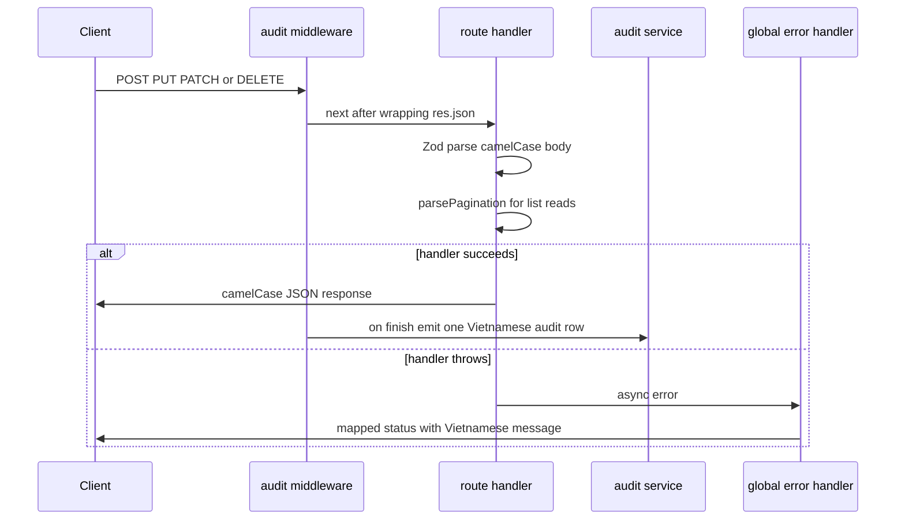

This page is the newcomer on-ramp: the rules a PR must satisfy and where each
one lives in code. `CONTEXT.md` and `docs/code-standards.md` carry the
canonical wording; where those docs have drifted from the source, this page
states what the code actually does today (two known doc drifts are flagged
below).

## TypeScript

- **Strict mode** is mandatory — `tsconfig.base.json` sets `"strict": true` and
  every package tsconfig extends it. No `any` types: the root ESLint config
  warns on `@typescript-eslint/no-explicit-any`, and the frontend adds a custom
  `@tingting/no-any` rule (also a warning) for `as any` / `: any` annotations.
- **Shared first.** Entity types live in `shared/src/types/`, Zod input schemas
  in `shared/src/schemas/` mirroring them. Prefer `z.infer`-derived input types
  (exported from the schemas) over hand-rolled interfaces. `shared/src/index.ts`
  is the barrel contract: backend and frontend import everything domain-level
  from `@tingting/shared` — enums, label maps, types, schemas, calculations,
  and API path constants.
- Files: `.ts` for backend/shared, `.tsx` for React components; new files are
  kebab-case (`trip-legs.ts`). Components are PascalCase, CSS classes kebab-case
  and page-scoped, env vars `SCREAMING_SNAKE_CASE`.
- Frontend type-checking is `tsc -b` (Vitest does **not** type-check); backend
  is `npx tsc --noEmit`.

## API shape: camelCase bodies, snake_case columns, both query spellings

- All REST endpoints are mounted under `/api` — there is **no `/v1` segment**
  (`backend/src/index.ts` mounts every router directly). Note that
  `docs/code-standards.md` still says `/api/v1/`; the code is authoritative.
- **Request bodies are camelCase**, validated by shared Zod schemas
  (`createTripSchema.parse(req.body)` …). **Database columns are snake_case**,
  mapped by Drizzle (`fuel_price_applied` ↔ `fuelPriceApplied`). Handlers pass
  camelCase objects to services, which pass camelCase to Drizzle.
- **List filters accept both query spellings** for id/date params:
  `(req.query.dateFrom || req.query.date_from)`, same for `truckId`/`truck_id`,
  `driverId`, `customerId`, `dateTo`. New list endpoints follow the same
  dual-reading pattern (see `routes/trips.ts`, `routes/forwarder.ts`, the
  `routes/financial/*` routers).
- **Responses are camelCase.** There is no response serializer — the old
  `middleware/serializer.ts` (snake_case rewriter) has been removed, even
  though some docs still mention it. Endpoints return plain objects
  (`res.json(trip)`) or pagination envelopes.
- Errors are `{ error: string, details? }`. Every user-facing message is a
  fixed Vietnamese string (`"Không tìm thấy"`, `"Dữ liệu đã tồn tại"`,
  `"Không có quyền truy cập"`, `"Lỗi máy chủ"`) — **`ApiError` never leaks raw
  ids or stack traces to clients** (stack is dev-only).
- Search uses `?q=` / `?search=`; the `unaccent` PostgreSQL extension is
  created at boot (`backend/src/index.ts`) and the CRUD factory filters with
  `unaccent(column) ILIKE unaccent('%term%')` so diacritics never break search.

*Every mutating request crosses the same middleware conventions: audit first,
Zod validation and parsePagination in the handler, one audit row after the
response or a mapped Vietnamese error.*

## Pagination — parsePagination everywhere

- **Every list endpoint** reads paging through
  `parsePagination(req)` from `backend/src/routes/utils/pagination.ts` —
  including `createCrudRouter`-generated catalog routes. Defaults: `page=1`,
  `limit=50`, `maxLimit=100`. It clamps negatives to 1, falls back on `0`/junk,
  supports `limitParam: 'pageSize'` (the expenses router uses it), and caps the
  page so `offset` cannot overflow a safe integer. Routers tune per endpoint,
  e.g. `{ maxLimit: 10_000 }` for the ledger, `{ limit: 200, maxLimit: 1000 }`
  for the forwarder portal.
- The wire envelope is the shared `PaginatedResponse<T>`:
  `{ items, total, page, pageSize }` — **not** `{ data: [...] }`.
- The frontend mirrors this: `fetchAllPaginated` (frontend/src/lib/http)
  walks pages at `pageSize: 100` with bounded concurrency and concatenates
  `items`; `tripClient.fetchAllTrips` does the same for trips.
- `backend/src/tests/pagination-parser.test.ts` and
  `list-endpoints-pagination.test.ts` pin the clamping rules and the
  non-overlapping-pages invariant.

## Error handling pipeline

`backend/src/middleware/errorHandler.ts` is the single mapping point:

| Priority | Error | Status | Response |
|---|---|---|---|
| 1 | Multer `LIMIT_FILE_SIZE` / other | 413 / 400 | Vietnamese size/validity message |
| 2 | `ZodError` | 400 | `{ error: "message (field)", details: issues }` |
| 3 | `ApiError` | custom | `{ error, details? }` |
| 4 | error with numeric `.status` | 400–599 | `{ error }` |
| 5 | PG unique violation `23505` | 409 | `"Dữ liệu đã tồn tại"` |
| 6 | fallback | 500 | `"Lỗi máy chủ"` (+ stack in dev only) |

Throw `ApiError` from `backend/src/errors.ts` for known application errors;
`throwValidation` in `backend/src/lib/validation.ts` standardizes Zod failures.
Express 5 propagates async handler errors without a wrapper.

## RBAC

- **Dual-layer pattern** — `casbinAuthz('resource')` at the mount point plus
  `requireRoles(...)` on sensitive endpoints. `requireRoles` lives in
  `middleware/casbin.ts` (not `auth.ts`); the HTTP method maps to action
  (`GET`→read, `POST/PUT/PATCH`→write, `DELETE`→delete).
- Resources without a Casbin policy row deny everyone except the ADMIN
  wildcard (`p, ADMIN, *, *`). Full model and role matrix:
  [backend/auth-rbac.md](../backend/auth-rbac.md).

## Audit logging

- **One audit row per mutating API call** (POST/PUT/PATCH/DELETE), no matter
  how many tables the handler touched. `auditLogMiddleware` is mounted before
  all routes; it wraps `res.json`, then writes **after** the response finishes
  (`res.on('finish')`) via the internal event bus, so auditing never delays or
  fails a request.
- Events are resolved from an explicit registry: routers call
  `registerAuditEvent(method, path, AuditEvent.*)` at module load
  (`routes/trips.ts` shows the full trip lifecycle set); unmatched routes fall
  back to generic created/updated/deleted events. Failed logins (401 on the
  login path) and 403 denials are audited too (`LOGIN_FAILED`,
  `ACCESS_DENIED`).
- Messages are **Vietnamese**, rendered from templates in
  `backend/src/services/audit-templates.ts` with role labels from
  `ROLE_LABELS`. Rows prefer **natural business keys over raw ids** — trip
  code, license plate, customer name (`entityKey`), resolved out-of-band by the
  audit service if the handler didn't supply one. Payloads are sanitized:
  passwords and provider API keys are stripped before persisting.
- Records: user/actor name, event, entity type + id + key, IP, and the
  sanitized `{ method, path, body }` payload. The old "before/after diff"
  wording no longer matches the implementation.
- Query endpoint: `GET /api/audit-logs`, gated by `casbinAuthz('audit_logs')`.
  Policy grants read to **ADMIN (wildcard), MANAGER, and ACCOUNTANT** —
  `docs/code-standards.md` says "ADMIN/MANAGER only", but `policy.csv` has an
  explicit `ACCOUNTANT, audit_logs, read` row. The SPA page is
  `/audit-logs` ("Nhật ký người dùng").

## Financial rules

- **Ledger is append-only.** Never `UPDATE` or `DELETE` ledger rows —
  corrections append an `ADJUSTMENT` row; trip unlocks append
  `UNLOCK_REVERSAL`. No update/delete endpoints exist on the ledger. See
  [backend/ledger.md](../backend/ledger.md).
- All monetary and quantity math lives in `shared/src/calculations/`:
  `round2dp()` for banker-safe 2dp rounding (backend services use it for every
  money aggregate), `roundInt()` for whole-liter fuel quantities, and
  `computeTripTotals()` as the single trip P&L function. Never hand-roll
  rounding at call sites.
- **VAT asymmetry** — revenue is recorded **ex-VAT** (`freightExVat =
  computeExVatAmount(revenue, vatRate)`), costs **incl-VAT** (gross). Do not
  normalize.
- **VND has no decimal places** in display: money columns are `numeric` with
  `scale: 0` and `formatCurrency` renders vi-VN integers. Internal math keeps
  2dp through `round2dp` until the final integer round.
- `fuelPriceApplied` is the **config snapshot at trip creation — never
  mutate it**; `fuelActualUnitPrice` is the per-trip override. Effective price
  is `actual ?? snapshot` (`computeTripTotals` uses nullish coalescing because
  `0` is a valid price). Per-purchase rows in `trip_fuel_allocations` may carry
  their own `unitPrice`; unpriced rows price at the trip's effective price.
  The same snapshot family applies to road allowance and fuel norms
  (`roadAllowanceBaseApplied`, `fuelLoadedNormApplied`, …).
- **One driver per trip** — each `trips` row points at exactly one
  `driverId`, even though a truck can have many drivers over time.

## Database & migrations

- **All access through Drizzle ORM** (postgres.js driver) — no raw SQL outside
  documented exceptions, no other query builders.
- Single schema file `backend/src/db/schema.ts`; **pgEnums at the top**, tables
  below, soft deletes via `deletedAt`.
- Migrations: `pnpm db:generate` then `pnpm db:migrate` (drizzle-kit) from
  `backend/`; `make dev` regenerates and applies automatically on startup.
- Production: `make prod-migrate` copies each `backend/drizzle/*.sql` to the
  prod Postgres container and applies it with `psql --single-transaction
  -v ON_ERROR_STOP=1`, **skipping `*.revert.sql` dev-rollback pairs**. Single
  file: `make prod-migrate-file FILE=xxxx.sql`. (The commit hash older docs
  cite for the revert-exclusion is history; the Makefile rule is current.)

## Configuration stance: keys gate integrations, no feature flags

- The project has a deliberate **no-feature-flags stance**: integrations turn
  on by *key presence*, not by enable toggles. OpenRouter OCR activates only
  when `OPENROUTER_API_KEY` is set and falls back to Gemini on error; the
  assistant bot activates with `BOT_ENABLE` + `MINIMAX_API_KEY` (the one
  exception, chosen for cost exposure), and live GPS degrades to empty without
  Bách Khoa credentials.
- Model names and base URLs are **hardcoded constants in code**
  (`OPENROUTER_MODEL`, `MINIMAX_BASE_URL` in services), not env config — change
  them in code. All env parsing is Zod-validated in `backend/src/config/index.ts`
  with strict boolean flag parsing (`true`/`1`/`yes` only).

## Frontend conventions

### Layout & CSS

- **Tailwind CSS v4** via `@tailwindcss/vite` — there is **no
  `tailwind.config` file**; `tokens.css` does `@import "tailwindcss"`. daisyUI 5
  is loaded as a plugin but every component class is prefixed `d-`
  (`.d-btn`, …) so it cannot collide with the project's own `.btn`/`.modal`/
  `.input` classes; the shared `nepo` theme mirrors the `:root` tokens.
- Page-scoped CSS is **co-located with its component** (`TripDetailPage.tsx`
  imports `TripDetailPage.css`); global component stylesheets are aggregated in
  `index.css` and `styles/responsive.css` is imported **last** so phone rules
  win the cascade.
- **No `!important`** in component/page CSS — use page-scoped selectors for
  specificity. The only sanctioned uses are global accessibility overrides
  (print, `prefers-reduced-motion`, tiny icon floors in `styles/`).
- **No truncation** of column values — wrap, tooltip, or card layout.

### Data display

- **No raw DB ids in UI text** — show business labels (customer name, route
  name, license plate). The backend mirrors this in audit messages.
- `<Money>` (`frontend/src/components/shared/Money.tsx`) renders VND with the
  unit (`₫`, or compact `tr ₫` / `tỷ ₫`) as a **subtitle-sized** span (0.6em)
  so it scales from hero numbers to table cells. Digits inherit surrounding
  size; `moneyParts` in `lib/format.ts` does the split.
- `StatusStrip` (`frontend/src/components/shared/StatusStrip.tsx`) is the
  canonical status marker: a **3×20px** color bar positioned mid-cell, driven
  by the `--status-strip-width/height/radius` tokens, and it appears on every
  status display (desktop + mobile). `StatusDot` and `StatusSwatch` are the
  legend/filter variants. `check:ui` fails the build if the tokens drift.
- Empty states use the illustration system in
  `frontend/src/lib/emptyIllustrations.ts` (PNGs resolved by category).
- Typography: exactly two self-hosted fonts — **Be Vietnam Pro** (text/UI) and
  **JetBrains Mono** (numerics) — loaded via `/public/fonts/fonts.css`; zero
  Google CDN.

## State & data fetching

- **TanStack Query owns server state.** Query keys must come from the
  `qk.*` factory in `frontend/src/api/keys.ts` — bare `queryKey: [...]` arrays
  are an **ESLint error** (`@tingting/no-bare-query-key`), because 170+
  scattered literal keys once caused double-fetches and cache drift.
- **No global state library.** Auth is React context (`AuthProvider` in
  `hooks/useAuth.tsx`, cached under `qk.auth.me`); everything else is custom
  hooks (`useCatalogs`, `useAuditLogs`, `useClickOutside`, `useTripForm`, the
  `use*Queries` family, …).
- Data access is layered: `lib/api/client.ts` is a transport-only `ApiClient`
  (fetch + Bearer token + session-expiry guard); domain clients in
  `frontend/src/api/*Client.ts` build endpoints and typed responses;
  `ApiError.fromResponse` translates backend error bodies into Vietnamese via
  the `FIELD_VI`/`MSG_VI` maps before any component sees an error.

### Mobile

- DRIVER and FORWARDER portals are mobile-first. Responsiveness is **not**
  primarily Tailwind utilities — it is the shared breakpoint cascade in
  `styles/responsive.css` (tablet ≤1023px, phone ≤640px, narrow ≤420px) plus
  co-located page CSS. The driver portal gets a **44px touch floor**
  (`.is-driver`, set from `Layout.tsx`) while the office workspace stays dense;
  `check:ui` enforces ≥36px inline touch targets and the phone control scale.

## Page catalog: one source for paths, titles, agent metadata

`shared/src/navigation/pageCatalog.ts` (`PAGE_CATALOG`, exported through the
shared barrel) is the single source for every SPA path, Vietnamese page title,
and agent-search description. It replaced four drifting copies:
`frontend/src/lib/routes.ts` consumed literal paths, `shared/src/schemas/agent.ts`
held the agent route keys, the backend agent tools kept a hand-written
description map, and `App.tsx` declared routes separately.

- `frontend/src/lib/routes.ts` **projects** the catalog: `routes.tripDetail(id)`
  stays a typed function, `titleRules` stays a hand-ordered precedence array —
  only the strings come from the catalog.
- The catalog is **not a router**: `App.tsx` still owns the `<Route>` elements
  and role guards (RBAC authority stays in App.tsx + Casbin, deliberately with
  no `roles` field in the catalog).
- Agent membership: an entry is AI-navigable iff it has an `agent` sub-object;
  `AGENT_ROUTE_KEYS` is compile-checked to equal exactly that set.
- **Adding a page = one catalog entry + the `App.tsx` route.** Nothing else.

## Dev server & ports

PostgreSQL **5440**, Redis **6390**, backend **3090**, frontend **7173**. Vite
runs with `strictPort: true` — if 7173 is taken the dev server **fails fast**
instead of silently drifting to 7174 (a second server once served a stale HMR
bundle). Dev proxy sends `/api` and the WebSocket `/socket.io` upgrade to
`http://localhost:3090`.

## Quality gates (manual — there is no CI)

The only gates are run by hand before landing; there is no CI pipeline and no
pre-commit hook (`pnpm lint` = ESLint 10 from the root; the frontend has its
own config with React/TanStack rules).

- `pnpm lint` — root (backend + shared) and `pnpm --filter frontend lint`.
- `pnpm --dir frontend check:ui` — `check-ui-contract.mjs`: typography token
  scale, the 3×20px status strip tokens, focus outlines, shared-primitive color
  tokens (no hex), phone control scale, and a TS-AST walk rejecting inline
  interactive `minHeight` under 36px.
- `pnpm --dir frontend check:brand` — `check-brand-contract.mjs`: TransTing
  name/tagline in `brand.ts`, the emerald palette (`#005A2D` family), sidebar
  gradient tokens, browser/PWA identity, and ImageMagick-verified asset
  geometry (favicon/logo/maskable sizes, safe zones).
- `pnpm --dir frontend build:strict` — `tsc -b` + the **600 non-blank-line**
  file budget (`check-size.mjs`) + `vite build`.
- Backend tests need the dev DB migrated first; `make build` compiles shared →
  backend → frontend in that order (shared first, always).

## Git

- Conventional commits: `feat:`, `fix:`, `refactor:`, `docs:`, `test:`,
  `chore:`. No AI references in commit messages.
- Keep commits focused and atomic; don't mix schema migrations with feature
  code.

## Where to read more

- Architecture overview — [architecture.md](../architecture.md)
- API routes & middleware order — [backend/api-routes.md](../backend/api-routes.md)
- RBAC + audit — [backend/auth-rbac.md](../backend/auth-rbac.md)
- Ledger semantics — [backend/ledger.md](../backend/ledger.md)
- Shared schemas & calculations — [shared/schemas.md](../shared/schemas.md), [shared/calculations.md](../shared/calculations.md)
- Frontend libraries & API layer — [frontend/lib.md](../frontend/lib.md)
- Testing & gates — [development/testing.md](testing.md)
- Domain glossary (authoritative) — `/CONTEXT.md`
- Code standards (authoritative; two known drifts flagged above) — `docs/code-standards.md`
