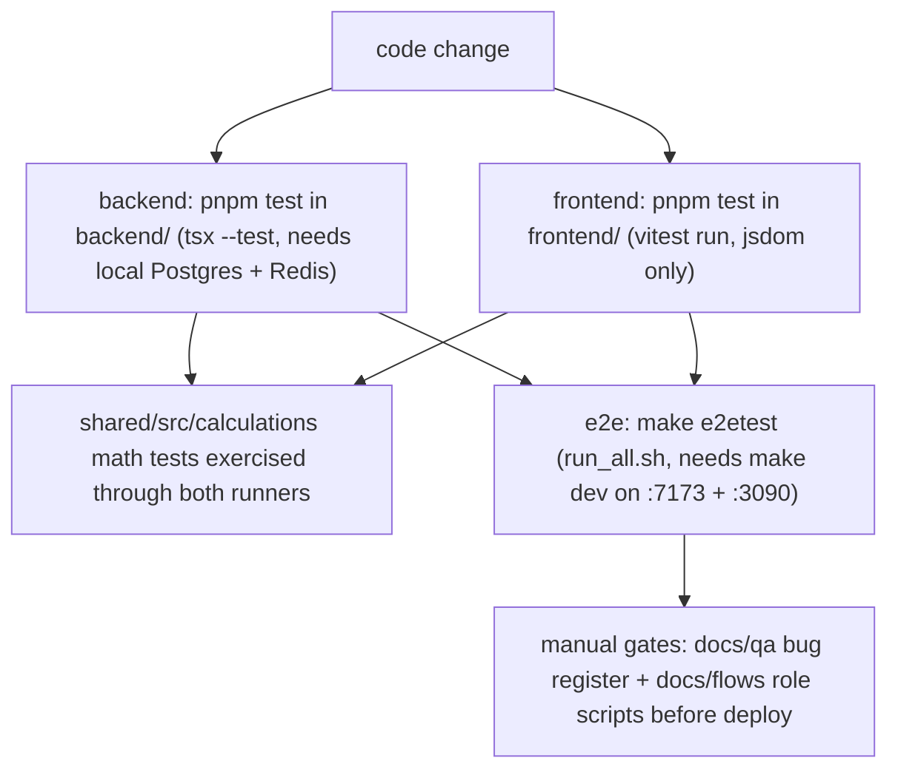

NEPO has three test surfaces — backend `node:test` suites executed through tsx,
frontend Vitest suites colocated with the code they cover, and a Python
Playwright e2e suite run against the live dev stack — plus a set of manual QA
documents. **There is no build/test/lint CI**: the only GitHub Actions workflow
is `.github/workflows/openwiki-update.yml`, a scheduled OpenWiki docs refresh
that performs no build, test, or lint. Every gate below is something a developer
runs by hand (see [setup.md](setup.md)).



_Quality gates and their prerequisites — all invoked manually; nothing is wired to CI._

## Backend tests — `tsx --test`

Backend tests live as 95 `*.test.ts` files under `backend/src/tests/`, run by:

```bash
cd backend && pnpm test
# → npx tsx --test --test-concurrency=1 src/tests/*.test.ts
```

`--test-concurrency=1` serializes execution: the suites share the dev Postgres
instance (and Redis for cache) and intentionally introspect rows other tests
wrote, so parallel runs would be nondeterministic. Backend suites therefore need
the local DB migrated and running first. The regression plan additionally
records that the runner historically needed `--test-force-exit` to exit cleanly;
the committed script does not pass it.

The files mix two styles:

- **Pure, data-driven tests** that need no services — e.g.
  `trip-status-machine.test.ts` encodes the full CREATED → IN_TRANSIT →
  COMPLETED → LOCKED → CANCELED transition matrix plus role rules (dispatch,
  lock, unlock, cancel are ADMIN/MANAGER-only) as a table documenting
  `docs/flows/01-TRIP_LIFECYCLE.md`, and `agent-eval-runner.test.ts` asserts
  intent routing against `agent-eval/golden-qa.json` without a live model.
- **DB-backed integration tests** — e.g. `comprehensive.test.ts` mounts real
  route modules on an in-process Express server on an ephemeral port with
  Casbin + audit middleware, then exercises auth, trips, and finance against
  the dev database; `photo-authz.test.ts` seeds hardcoded storage keys (never
  via the production helper, whose `Date.now()` would mask key collisions) and
  verifies exact-`storage_key` resolution with strictest-match authorization
  for the ambiguous `expense-photos/` prefix.

Representative suites:

- `trip-status-machine.test.ts` — lifecycle transition matrix + role gates.
- `ledger.service.chiho.test.ts`, `ledger-balance-aggregates.test.ts`,
  `chiho-reconciliation.test.ts` — ledger semantics.
- `photo-authz.test.ts` — receipt-photo authorization decision matrix.
- `pnl-invariant.test.ts`, `financial-overview-lane.test.ts`,
  `summary-lane.test.ts`, `deterministic-report-lane.test.ts` — financial read
  models.
- `fuel-multi-price.test.ts`, `route-fixed-fuel-allowance-helper.test.ts`,
  `route-fixed-fuel-allowance-live-fallback.test.ts` — the regression guards
  added for BUG-REG-012/013 (see the bug register below).
- `forwarder-settlement-workflow.test.ts`,
  `forwarder-admin-settlement-ops-completion.test.ts` — forwarder settlements.
- `faq-fast-lane.test.ts`, `faq-latency.test.ts`, `faq-admin.test.ts` — FAQ
  fast lane.
- `gps.service.test.ts`, `gps-settings-schema.test.ts`,
  `gps-admin.rbac.test.ts` — GPS subsystem.
- 14 `agent-*.test.ts` files — assistant streaming, tool selection, telemetry.
- `comprehensive.test.ts` — broader integration smoke.

## Shared package math tests

`shared/src/calculations/` — the single source of truth for financial math
(`round`, `tripTotals`, `tripDriverSalary`, `fifoAging`, `iso6346`,
`vehicleAlerts`) — carries colocated `*.test.ts` files written against
`node:test`. They are **not** wired to any package script
(`shared/package.json` defines only `build`/`typecheck`) and are excluded from
the shared build via `tsconfig.json`. Per the regression plan they are
exercised transitively: backend tests and frontend Vitest both import the
calculation modules, so regressions surface in those runners. Because the
frontend Vitest config aliases `@tingting/shared` to `../shared/src`, the
frontend runs the same source directly, without a build.

## Frontend tests — Vitest

Frontend tests are colocated with the code they cover as `*.test.ts` /
`*.test.tsx` — 112 files spread across `pages/`, `hooks/`, `components/`,
`features/`, `lib/`, `design-system/`, and `api/`:

```bash
cd frontend && pnpm test    # vitest run
```

`vitest.config.ts` runs with `globals: true` in a `jsdom` environment over
`src/**/*.test.{ts,tsx}`, defines `__BUILD_SHA__`, and aliases `@` → `src` and
`@tingting/shared` → `../shared/src`. Tests mount real page components in
`MemoryRouter` + `QueryClientProvider` and mock the query hooks with
`vi.hoisted` mocks. Named examples:

- `admin-advance-settlement-summary.test.ts`,
  `admin-advance-settlement-ledger-density.test.tsx`,
  `admin-advances-actions.test.tsx` — advance-settlement page logic and rows.
- `customer-debt-projection.test.ts` — customer AR recomputation from ledger
  entries.
- `useAuth.test.tsx` — session-cache isolation on account switching/logout.
- `useAgentChat.test.ts` — assistant message-stream preservation.
- `useBottomNavAnimations.test.tsx` — animation lifecycle under a mocked
  animejs.

### Load-safety tests — the idiom worth copying

A family of `*-load-safety.test.tsx` files locks in one rule: **a failed or
in-flight query must never render as editable, empty, or defaulted content.**
Each failure path must show an `alert` + retry, and each loading path a
`status` placeholder:

- `salary-load-safety.test.tsx` — if any of the salary list / work days /
  salary / period queries fails, the page shows "Không thể tải dữ liệu kỳ
  lương" with a working "Thử lại" button and no editable attendance grid;
  while loading, no editable attendance either. Driver selection is asserted
  to be focusable buttons with `aria-pressed` state.
- `forwarder-settlement-load-safety.test.tsx` — loading must not turn into an
  empty payable form ("Đang tải tạm ứng và chi phí" status instead); errors
  block submission and retry both authoritative option lists; a rejected
  submission retains the user's checkbox selections for the retry.
- `expense-load-safety.test.tsx` — a failed original-expense fetch renders
  "Không thể tải chi phí" + retry instead of an editable blank expense.
- `config/config-load-safety.test.tsx` — a failed salary-rule or company-info
  fetch hides the save button and current values; failed saves surface in an
  `alert`.

### Focus and a11y regression tests

- `TripListPage.quick-edit-focus.test.tsx` types one character at a time into
  whatever `document.activeElement` is — reproducing how a browser types — to
  catch the defect where the quick-edit cell remounts on the first keystroke
  and silently drops the rest of the amount; it asserts the same DOM element
  stays focused with the full typed value.
- `admin-advances-actions.test.tsx` asserts approve/reject render as distinct,
  accessible named buttons that fire the right mutations.
- `ExpenseEntryPage.error-state.test.tsx` checks every invalid required
  control gets the error class on submit — and valid ones never do.
- `portal-list-recovery.test.tsx` keeps portal search focus alive across
  loading states and renders real totals when reduced motion skips counters;
  `design-system/forms/FieldAccessibility.test.tsx` and
  `components/shared/DialogKeyboard.test.tsx` cover the shared primitives.

## End-to-end suite — `e2e/`

`e2e/` is a Python Playwright suite of 14 suites, `test_00_auth.py` through
`test_13_forwarder_portal.py`, and is **not** part of `pnpm test`. It runs via
`make e2etest` → `bash e2e/run_all.sh` (optionally `./e2e/run_all.sh 00 13` for
specific suites) against the **running local dev stack**: the runner checks
that python3 and Playwright are available (auto-installing Playwright +
Chromium if missing) and that the frontend answers on :7173 and the backend on
:3090 — otherwise it aborts with "Run 'make dev' first".

Coverage areas map to the `docs/flows/*.md` scripts:

| Suite | Area |
|---|---|
| `test_00_auth.py` | login per role, logout, wrong-password 401, navigation guards |
| `test_01_trip_lifecycle.py` | catalog-driven trip create, detail/list/edit pages, RBAC (ACCOUNTANT can view, DRIVER create → 403) |
| `test_02_trip_list.py` | trip list & search |
| `test_03_dashboard.py` | dashboard & financial reports |
| `test_04_debt.py` | debt & payments |
| `test_05_profit.py` | profit distribution |
| `test_06_penalties.py` | penalties & discipline |
| `test_07_fleet.py` | fleet & dispatch |
| `test_08_customers.py` | customers |
| `test_09_config.py` | system configuration |
| `test_10_system_admin.py` | users & audit logs |
| `test_11_driver_portal.py` | driver mobile portal |
| `test_12_vendor_expenses.py` | vendor expenses & payables |
| `test_13_forwarder_portal.py` | forwarder portal RBAC, trips, containers, expenses |

The suites assert RBAC boundaries twice: in the UI (a forbidden role gets
redirected off the route) and at the API (401/403 status codes, including
expired/invalid tokens). `helpers.py` provides the shared scaffolding —
`DEMO_ACCOUNTS` for the five roles (all `admin123`: `admin`, `giamdoc`,
`ketoan`, `laixe`, `giaonhan`, each with its home page), an `ApiClient` that
logs in via `POST /api/auth/login` and sends JWT bearer requests, a headless
Chromium `NepoTestContext`, screenshot capture, `TestResults` with
per-suite pass/fail/skip + JSON output, and the `run_suite` entry point whose
exit code signals suite failure. Base URLs come from `NEPO_URL` /
`NEPO_API` (defaults `http://localhost:7173` and `http://localhost:3090`).

Two runner quirks to know: `run_all.sh` executes with `set -euo pipefail`, so
the first suite whose Python process exits non-zero (any FAIL) aborts the loop
before the aggregate summary; and the aggregate globs
`/tmp/tingting-e2e/*_results.json` while `helpers.py` defaults to writing
under `/tmp/nepo-e2e` (override with `NEPO_SCREENSHOTS`), so the aggregated
block can find no files even when suites ran. Per-suite console summaries and
screenshots are unaffected.

### Fixtures and audits

- `seed_operational_qa.py` populates an isolated local database with realistic
  synthetic operations (customers, suppliers, routes, road allowances, pricing
  tables, 40 trips across all statuses, expenses, advances, payments) using
  only the business APIs. It is safety-guarded: it refuses any origin that is
  not loopback :3090, records every write in an exclusive manifest under
  `/tmp/nepoprod-qa/` that makes repeat runs read-only, and preflights that no
  GPS provider is configured and no push subscriptions exist — so trip
  completions cannot call external services.
- `seed_ui_audit.py` creates one synthetic record per entity (customer, route,
  cargo, trip, trailer, expense, debit-note template, plus a forwarder
  advance → approve → settlement chain) on localhost and writes a fixture JSON.
- `ui_route_audit.py` consumes that fixture for a **read-only** audit: it
  regex-parses the route guards (`strictAdminOnly`, `managerOrAdminOnly`,
  `driverOnly`, `forwarderOnly`) out of `frontend/src/App.tsx`, visits every
  allowed route for each of the five roles at multiple viewport widths,
  records page errors and API responses ≥ 400, and writes the coverage matrix
  outside the repository.

## Manual QA artifacts — `docs/qa/` and `testplan/`

`docs/qa/` holds:

- `regression-test-plan.md` — the bug register: every fixed bug becomes a
  `BUG-REG-xxx` case with symptom / repro / expected / root cause / guard;
  run all non-SKIP cases before every production/demo deploy, and reopen a
  case when a bug recurs. Its "Chạy tự động" section fixes the runner
  invocations: `cd frontend && npx vitest run`, `cd backend && pnpm test`,
  with shared calc covered through both.
- `test-checklist.md` — the role-by-role execution checklist (one role + one
  flow per item) with pass/bug markers per iteration.
- `quan-ly-checklist.md`, `service-cost-checklist.md` — role-specific
  checklists for office staff.
- `iterations/`, `iterations-quan-ly/`, `iterations-service-cost/` — historic
  iteration logs.
- `pete-feedback-2026-06-02.md` — internal feedback ledger.
- `approval-queue-inventory.md`, `config-polish-audit.md` — change-management
  artifacts.

`testplan/testaccounts.txt` holds the account fixtures for manual QA: local
dev logs in `admin / admin123` (the seed default — `Abc123` does not work
locally), demo uses `Abc123`, vantai `123456`; it also documents the JWT
claims (`userId`, `username`, `role` — a missing role claim gets a Casbin 403)
and a one-liner for minting dev tokens.

## Authoritative Vietnamese test docs

`docs/flows/` contains the role-by-role test scripts the team actually walks
through:

- `00-OVERVIEW_VA_PHAN_QUYEN.md` — overview and role matrix.
- `01-TRIP_LIFECYCLE.md` — trip end-to-end.
- `02-TRIP_LIST_VA_TIM_KIEM.md` — trip list and search.
- `03-DASHBOARD_VA_BAO_CAO.md` — dashboards and reports.
- `04-CONG_NO_VA_THANH_TOAN.md` — debt and payments.
- `05-PHAN_BO_LOI_NHUAN.md` — profit distribution.
- `06-KY_LUAT_VA_PHAT.md` — penalties.
- `07-DOI_XE_VA_FLEET.md` — fleet.
- `08-KHACH_HANG.md` — customers.
- `09-CAU_HINH_HE_THONG.md` — system configuration.
- `10-QUAN_TRI_HE_THONG.md` — admin.
- `11-LAI_XE_MOBILE.md` — driver mobile.
- `12-CHI_PHI_NCC_VA_CONG_NO_PHAI_TRA.md` — supplier costs and AP.
- `13-GIAO_NHAN_VA_TAM_UNG.md` — delivery and advances.
- `14-LUONG_VA_CHAM_CONG.md` — salary and attendance.
- `15-QUAN_LY_LOP_XE.md` — tire management.

## Auxiliary manual gates

- `pnpm lint` (ESLint; root `eslint.config.mjs` plus a per-package config in
  `frontend/`) is not wired to CI and is not run by the dev loop by default.
- The frontend `check:ui` / `check:brand` scripts verify UI/brand contracts,
  and `build:strict` runs `scripts/check-size.mjs`, which fails the build when
  any `.ts/.tsx` file exceeds 600 lines.

## Where to read more

- Setup — [setup.md](setup.md)
- Conventions — [conventions.md](conventions.md)
- Service layer under test — [backend/services.md](../backend/services.md)
- Hooks under test — [../frontend/hooks.md](../frontend/hooks.md)
