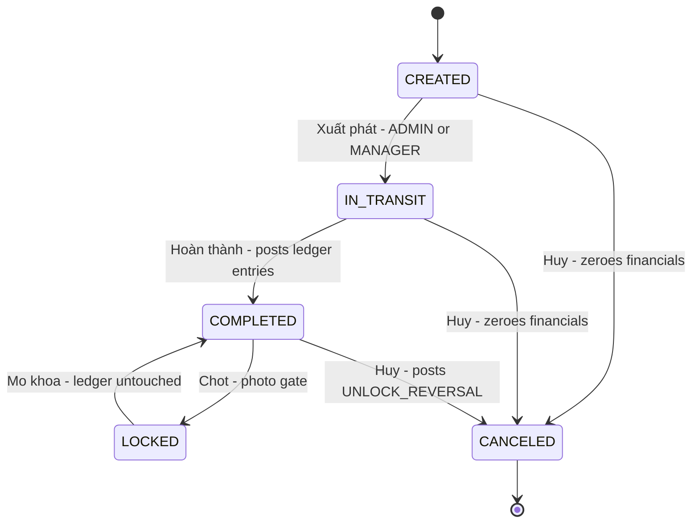

This page maps each Vietnamese business term to the system concept, the code
that implements it, and the enum that carries its canonical label. Two sources
define the wording:

- **`shared/src/constants/index.ts`** owns the user-facing Vietnamese labels
  (`TRIP_STATUS_LABELS`, `ROLE_LABELS`, `PENALTY_STATUS_LABELS`,
  `NOTIFICATION_TYPE_LABELS`, `FUEL_MODE_LABELS`, `LOADING_TYPE_LABELS`,
  `CARRIER_TYPE_LABELS`, `SETTLEMENT_METHOD_LABELS`,
  `VEHICLE_SCHEDULE_KIND_LABELS`, `TIRE_STATUS_LABELS`,
  `FORWARDER_EXPENSE_TYPE_DEFAULTS`, …). When a rename is proposed, change the
  LABELS map first — the UI renders through it.
- **`docs/flows/*.md`** (indexed by `docs/flows/README.md`) are the
  authoritative Vietnamese business/QA documents, one per feature area
  (00 overview/RBAC … 15 tire management). The old `/CONTEXT.md` glossary has
  been deleted; this page is the term map.

## Trips (Chuyến xe)

| Term | English | System concept |
|---|---|---|
| Chuyến xe | Trip | `trips` table; `TripStatus` pgEnum |
| Mới tạo | Created | `TripStatus.CREATED` — label `Mới tạo` |
| Đang chạy | In Transit | `TripStatus.IN_TRANSIT` — label `Đang chạy` |
| Hoàn thành | Completed | `TripStatus.COMPLETED` — label `Hoàn thành` |
| Đã khóa | Locked / Finalized | `TripStatus.LOCKED` — label `Đã khóa` (docs also say "chốt chuyến"); frozen-figures state |
| Đã hủy | Canceled | `TripStatus.CANCELED` — label `Đã hủy` |
| Chặng | Leg | `trip_legs`; `loadingType` per leg |
| Hàng | Loaded | `LoadingType.HANG` — label `Hàng` |
| Vỏ | Empty | `LoadingType.VO` — label `Vỏ` |
| Loại hàng yêu cầu ảnh | Photo-required cargo | `cargo_types.requiresPhotos` — forces CONTAINER + SEAL photos at lock |
| Xuất phát | Dispatch | CREATED → IN_TRANSIT; ADMIN/MANAGER only |
| Chốt / Mở khóa | Lock / Unlock | COMPLETED → LOCKED; LOCKED → COMPLETED (reopen) |
| Xe nhà / Xe ngoài | Own / External carrier | `CarrierType` labels; external carriers reference `customers` (`trips.externalCarrierId`) |

The five-state lifecycle is enforced by
`backend/src/services/trip-status-machine.service.ts`:

Trip lifecycle; ledger rows post at completion, lock freezes, cancel from
COMPLETED reverses them.

Key guards in the status machine: only one IN_TRANSIT trip per truck
(advisory lock per truck); EXTERNAL trips need `externalPlateNumber` before
completion; lock requires non-zero revenue (soft `confirmZeroRevenue` override)
and a photo gate (≥1 photo, plus CONTAINER + SEAL when the cargo type opts in,
with `confirmNoPhoto` override). Ledger rows (TRIP_REVENUE, DRIVER_SALARY,
FUEL_EXPENSE, EXTERNAL_CARRIER_COST, SERVICE_FEE) post when the trip reaches
COMPLETED — not at lock; unlock never reverses them, while canceling a
COMPLETED trip posts `UNLOCK_REVERSAL` rows. See
[backend/services.md](backend/services.md) for the transition matrix.

## Financials (Tài chính)

| Term | English | System concept |
|---|---|---|
| Sổ cái | Ledger | `ledger` table — append-only, no UPDATE/DELETE |
| Doanh thu | Revenue | `TxnType.TRIP_REVENUE` debit on CUSTOMER (note `Doanh thu chuyến <code>`); recorded revenue = freight ex-VAT − `customerCommission` |
| Hoa hồng (KH) | Customer commission | `trips.customerCommission` — entered at data entry, deducted from freightExVat → `recordedRevenue` |
| Công nợ phải thu | Accounts Receivable | CUSTOMER ledger balance (debit increases); FIFO aging via `computeFifoAging` in `shared/src/calculations/fifoAging.ts` |
| Công nợ phải trả | Accounts Payable | VENDOR / CARRIER / FORWARDER ledgers (credit increases payable); `aging.service.ts` inverts signs for vendor aging |
| Thu tiền | Payment received | `TxnType.PAYMENT_RECEIVED` credit on CUSTOMER |
| Điều chỉnh | Adjustment | `TxnType.ADJUSTMENT` — corrections are new rows, never edits (ledger label `ĐIỀU CHỈNH`) |
| Phí quản lý | Management Fee | `management_fees` table (per month/year row; seed 8,000,000 ₫/month); `TxnType.MANAGEMENT_FEE`; P&L currently reports `managementFee = 0` |
| Lợi nhuận gộp | Gross Profit | UI `Lợi nhuận gộp hoạt động` = revenue − fleet operating cost (incl. maintenance) |
| Lợi nhuận ròng | Net Profit | UI `Lợi nhuận ròng chia cổ đông` = gross profit − company expenses (Chi phí chung công ty) + other income |
| Thu nhập khác | Other Income | UI `Thu nhập phạt vi phạm` — Σ active (non-CANCELED) penalties in the period; NOT a company expense |
| Giấy báo nợ | Debit Note | `billing_documents` (`DEBIT_NOTE`) + `debit_note_templates` (default title `GIẤY BÁO NỢ`); customer `debitNoteMode` MONTHLY / PER_BATCH; see below |
| Bảng kê | Payment statement | `billing_documents` with `type = 'PAYMENT_STATEMENT'` |
| Phân bổ lợi nhuận | Profit Distribution | `truck_cap_table` (partner role INVESTOR `Đối tác` / DRIVER `Lái xe`), `cap_table_history`, `distributions` — LOCKED trips only |

The P&L (`backend/src/services/pnl.service.ts`) and profit distribution both
report over the **salary-period window** (see Kỳ lương below), not the calendar
month.

Sign convention in `LedgerService.postEntry`: for CUSTOMER, debit increases the
outstanding receivable and credit decreases it; for DRIVER, VENDOR, FORWARDER
and CARRIER, credit increases the payable and debit decreases it. Every term
above that mentions "balance" inherits this rule. See
[backend/ledger.md](backend/ledger.md) for the ledger rules.

### Giấy báo nợ — billing status vs P&L status

`BILLABLE_TRIP_STATUSES = [COMPLETED, LOCKED]` in
`shared/src/constants/index.ts`: a trip becomes billable on debit notes and
carrier payment statements once its revenue has posted (at COMPLETED). Profit
distribution deliberately reads **LOCKED trips only** (stored `grossProfit`,
never recomputed). Note a documentation gap: the constants comment still says
P&L stays LOCKED-only, but `pnl.service.ts` currently selects COMPLETED +
LOCKED trips. When touching either consumer, re-check the constant's comment
against both services.

## Drivers / Customers / Vendors / Forwarders

| Term | English | System concept |
|---|---|---|
| Lái xe | Driver | `drivers` (one driver per OWN trip); `Role.DRIVER` mobile portal |
| Khách hàng | Customer | `customers` (`CustomerStatus`: ACTIVE/LOCKED, `creditLimit`); external carriers are customers with `isCarrier` |
| Nhà cung cấp | Vendor / Supplier | `suppliers` (+ `isFuelSupplier` flag); ledger entity `VENDOR` |
| Giao nhận | Forwarder | `Role.FORWARDER` (label `Giao nhận`) — forwarder portal, trip expenses, advances |
| Phí chi hộ | Ancillary/on-behalf fees | `trip_expenses` + `FORWARDER_EXPENSE_TYPE_DEFAULTS` (Phí nâng container, Phí hạ container, Phí cân hàng, Phí làm tờ khai hải quan, …); approved sell side posts `SERVICE_FEE` to the customer |
| Phiếu hoàn ứng | Advance settlement | `advance_settlements` (code `PT-YYMM-NNNN`) — see Tạm ứng below |
| Container / Seal | Container / Seal | `trip_containers`, `trip_container_seals` (multi-seal per container) |

## Fuel & allowance (Nhiên liệu & tiền đi đường)

| Term | English | System concept |
|---|---|---|
| Tự động | Auto fuel calc | `FuelMode.AUTO` — label `Tự động`; Σ per-leg norm liters + supplements |
| Khoán | Flat-rate fuel | `FuelMode.FLAT_RATE` — label `Khoán`; manual `fuelLitersOverride` wins over every norm |
| Định mức nhiên liệu | Fuel norm | `fuel_config.loadedNorm` / `emptyNorm`, snapshotted per trip (`fuelLoadedNormApplied`, `fuelEmptyNormApplied`) |
| Phụ cấp định mức | Fixed route fuel allowance | `routes.fixedFuelAllowance` (`fuelFixedAllowanceApplied`) — when set it takes precedence over per-leg norms in AUTO mode |
| Bổ sung | Supplement | `fuelConfig.supplement` (default 3 L/trip) + manual `fuelSupplementLiters`; liters round to whole numbers at issue |
| Cây dầu ngoài | External pump (cash) | The CASH row in `trip_fuel_allocations` (`paymentMethod='CASH'`, no supplier) — never creates vendor debt |
| Giá nhiên liệu | Fuel unit price | effective price = `fuelActualUnitPrice ?? fuelPriceApplied` snapshot; history in `fuel_price_history`; per-purchase prices may override row-by-row |
| Tiền đi đường | Road allowance (cash) | `base − (tollsStations × tollPerStation) + returnCargoBonus (if hasReturnCargo)`, minus `tollsDiscount`, floored at 0; `tollsAddition` replaces the computed base when > 0; + `twoPointDeliveryBonus` for OWN trips |
| Tiền chuẩn | Base rate | `road_allowances.baseAmount`, unique per (route × trailerType 20FT/40FT) |
| Phí trạm | Toll per station | `road_config.tollPerStation` (seed 150,000 ₫ — configurable, not a fixed constant) |
| Trả hàng | Return cargo bonus | `road_config.returnCargoBonus` (seed 500,000 ₫) |
| Phí đường bộ | Annual road-use fee | `VehicleScheduleKind.ROAD_FEE` (label `Phí đường bộ`) reminder + renewable expense category (`expense_categories.isRenewable`) — NOT part of per-trip road allowance |

The fuel + road-allowance math lives in
`shared/src/calculations/tripTotals.ts` (`computeTripTotals`,
`computeRoadAllowance`) and is shared by backend and frontend. See
[shared/calculations.md](shared/calculations.md).

## Penalties & salary (Kỷ luật & lương)

| Term | English | System concept |
|---|---|---|
| Kỷ luật | Penalty | `penalties` table; `PenaltyStatus` labels `Hiệu lực` (ACTIVE) / `Đã hủy` (CANCELED) |
| Lý do kỷ luật | Penalty reason | `penalty_reasons` catalog (`defaultAmount`, `severity` minor/moderate/severe) |
| Phạt | Penalty ledger row | `TxnType.PENALTY` **debit** on the DRIVER ledger (note `Kỷ luật chuyến <code>`) — a salary deduction, NOT a company expense |
| Lương sản lượng | Trip (output) salary | `TxnType.DRIVER_SALARY` credit on DRIVER at completion; per-trip amount = `baseSalary / 26 × tripWageDays` (`shared/src/calculations/tripDriverSalary.ts`) |
| Kỳ lương | Salary period | `salary_periods` — reporting window config: per-month override → global default (25th → 24th) → calendar month fallback |
| Ngày công | Work day | `driver_work_days` (`workDayStatus`: TRIP_DAY / STANDBY / PERSONAL_LEAVE / WEEKLY_OFF) |
| Xác nhận lương | Salary confirmation | `salary_confirmations` (`salary_confirmation_status`: DRAFT / CONFIRMED per driver + month) |

Penalties reduce the **driver's** balance (they owe the company) and are
surfaced in P&L as **other income** (`otherIncome = Σ penalties`), never as a
cost line. See [backend/ledger.md](backend/ledger.md).

## Tạm ứng & quyết toán (Forwarder advances & settlements)

| Term | English | System concept |
|---|---|---|
| Tạm ứng | Advance | `advance_requests` (`AdvanceRequestStatus`: Chờ duyệt / Đã duyệt / Từ chối); approval posts `TxnType.FORWARDER_ADVANCE` on the FORWARDER ledger |
| Hoàn ứng / Quyết toán | Settlement | `advance_settlements`; accountant approves once → one `TxnType.FORWARDER_SETTLEMENT` debit |
| Chi hộ / Công ty trả | Settlement method | `SettlementMethod` labels: `Công ty trả trực tiếp` (COMPANY_DIRECT) / `Chi hộ tạm ứng` (FORWARDER_ADVANCE) |
| Số dư còn tạm ứng | Outstanding advance balance | `Tổng đã nhận − Đã thanh toán` (the forwarder's 4-KPI header) |

On approval, a refund surplus (`refundAmount`) is materialized as a new
approved advance + `FORWARDER_ADVANCE` row so it stays selectable for the next
settlement; `reimbursementAmount` is what the company repays when expenses
exceeded the advance. Only expenses in a group the ops confirmed
**Đã kê xong** (declared complete) may enter a settlement.

## Fleet & vehicles (Đội xe)

| Term | English | System concept |
|---|---|---|
| Xe đầu kéo | Tractor / Truck | `trucks` (`VehicleComponent.TRUCK`, label `Xe đầu kéo`) |
| Rơ-moóc | Trailer | `trailers` (`TRAILER_TYPE` 20FT/40FT; `TRAILER_STATUS_LABELS`: Hoạt động / Bảo trì / Ngưng hoạt động) |
| Đội xe | Fleet | FleetPage at `/fleet` — trucks, trailers, drivers, and schedules |
| Lịch phương tiện / Lịch bảo dưỡng | Vehicle schedule | `vehicle_schedules` — `VehicleScheduleKind` labels: Bảo dưỡng / Đăng kiểm / Bảo hiểm / Phí đường bộ / Hồ sơ / Khác; status Đang nhắc (ACTIVE) → Đã hoàn thành / Đã hủy, with `remindAt ≤ dueAt` check |
| Lốp xe | Tire | `tires` — immutable serial; mounts on a truck OR trailer; `TIRE_STATUS_LABELS`: Dự phòng (IN_STOCK) / Đang dùng (IN_USE) / Đã thanh lý (DISPOSED); disposal reasons list (Hư hỏng, Mòn gai lốp, Rò rỉ, Hết tuổi thọ, Bán, Mất, Khác) |

Tire lifecycle (`backend/src/services/tire.service.ts`): install → IN_USE,
remove → back to IN_STOCK, dispose → DISPOSED (permanent), transfer keeps
`installed_at` so tire age survives the move. Vehicle schedules are created
from the Fleet page ("Tạo lịch") and surface as dashboard/Fleet reminder
banners; `computeVehicleAlerts` (`shared/src/calculations/vehicleAlerts.ts`)
adds per-truck compliance alerts (Hạn đăng kiểm, Hạn bảo hiểm, Thay dầu kế tiếp).

## System / audit / RBAC

| Term | English | System concept |
|---|---|---|
| Vai trò | Role | `Role` enum: ADMIN / MANAGER / ACCOUNTANT / DRIVER / FORWARDER |
| Quyền | Permission | Casbin policy (`backend/src/casbin/policy.csv`), one row per role × object × action |
| Quản trị viên | Admin | `Role.ADMIN` (label `Quản trị viên`; policy row `p, ADMIN, *, *`; not a business user) |
| Giám đốc / Quản lý | Manager / Director | `Role.MANAGER` — label `Quản lý` in ROLE_LABELS; docs/flows also call the role `Giám đốc` |
| Kế toán | Accountant | `Role.ACCOUNTANT` (label `Kế toán`) — trips/config/financial write; per the status machine, lifecycle moves stay ADMIN/MANAGER-only |
| Lái xe (role) | Driver role | `Role.DRIVER` — Casbin object `driver_portal`; reads own trips/earnings/penalties |
| Giao nhận (role) | Forwarder role | `Role.FORWARDER` — Casbin object `forwarder_portal`; no revenue/cost fields in portal payloads |
| Vai trò tài chính | Financial roles | `FINANCIAL_ROLES = [ADMIN, MANAGER, ACCOUNTANT]` — expense approval + financial report access |
| Sự kiện / Hành động | Audit event | `audit_logs` — one mutation API call = one Vietnamese natural-language row written by `auditLogMiddleware` (e.g. "Quản lý <actor> khóa chuyến <tripCode>") |
| Hỏi đáp (tri thức) | FAQ knowledge base | `faq_entries` + `knowledge_chunks` (pgvector) — pre-LLM fast lane for the in-app agent (`backend/src/services/agent/faq-fast-lane.ts`): exact → rule → cosine → score/margin gate, fail-open to the LLM |

Role labels are the literal strings in `ROLE_LABELS`; push-notification
wording comes from `NOTIFICATION_TYPE_LABELS` (e.g. `Chuyến mới`,
`Phạt mới`, `Sắp chốt kỳ lương`, `Phiếu hoàn ứng đã duyệt`), with only a
whitelisted subset waking devices (`PUSH_RULES`). See
[backend/auth-rbac.md](backend/auth-rbac.md) and
[backend/services.md](backend/services.md).

## Reference docs

- Flow index (`docs/flows/README.md`) — per-feature Vietnamese QA/user manuals
  00–15 plus `docs/flows/DELIVERY_TRIP_LIFECYCLE.md` (trip-lifecycle deep dive)
- Related pages: [backend/auth-rbac.md](backend/auth-rbac.md),
  [backend/ledger.md](backend/ledger.md),
  [backend/services.md](backend/services.md),
  [shared/calculations.md](shared/calculations.md)
