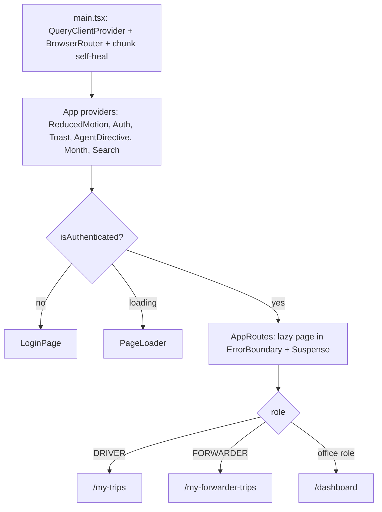
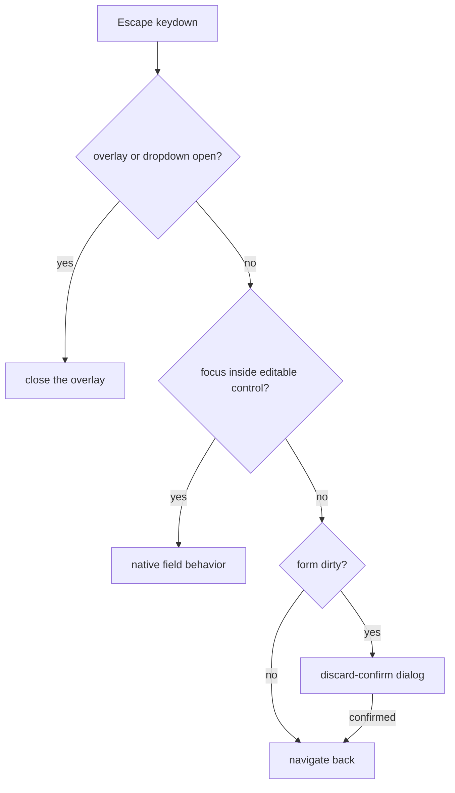
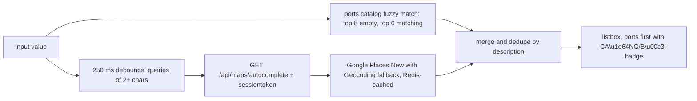

# Frontend App Shell & Pages

NEPO's frontend is a React 19 + Vite + Tailwind v4 SPA under `frontend/src`.
`frontend/src/App.tsx` owns routing and the client-side role guards, a shared
`Layout` renders the sidebar/topbar/bottom-nav shell, and page sections live in
two composition layers: `frontend/src/features/<domain>/` (rows, panels, hooks
per business domain) and `frontend/src/pages/config/` (catalog CRUD screens
built on one generic `CrudTable`).

## Bootstrapping (`main.tsx`)

`frontend/src/main.tsx` mounts the app and sets up three operational behaviors:

- **Query client defaults** — `retry: false`, `refetchOnWindowFocus: false`,
  5-minute `staleTime`; pages rely on this for calm, cached server state.
- **Stale-chunk self-heal** — `installChunkErrorHandler()` runs before React
  mounts so a dynamic-import failure after a deploy (tab still references a
  chunk the new service worker no longer has) purges the SW cache and reloads
  once instead of hanging on the "Đang tải…" spinner.
- **PWA service worker** — registered in production only; `sw.js` calls
  `skipWaiting()` + `clients.claim()`, and the page reloads once on
  `controllerchange` so a newly deployed worker takes over immediately.

The tree is `QueryClientProvider → BrowserRouter → App`.

## Provider stack and auth gate (`App.tsx`)

`App` nests, outermost to innermost: `ReducedMotionProvider`, `AuthProvider`,
`ToastProvider`, `AgentDirectiveProvider`, `MonthProvider`, `SearchProvider`,
then `AppRoutes`. `ReducedMotionProvider` sits outside `AuthProvider` so a
single `matchMedia` listener serves every animation-aware consumer.
`MonthProvider` holds the global report month/year used by the topbar month
picker; `SearchProvider` holds the topbar search query; `AgentDirectiveProvider`
is the bot → SPA bridge that resolves catalog route keys to paths and stashes
open/prefill directives until the target page registers a handler.

While `useAuth()` is loading, `AppRoutes` renders only the `PageLoader`
("Đang tải…"); when unauthenticated it renders only `LoginPage`. Both `/` and
the wildcard route redirect to the role home: `/my-trips` for DRIVER,
`/my-forwarder-trips` for FORWARDER, `/dashboard` for office roles.

Bootstrapping, auth gate and role-home redirects of the SPA shell.

## Routing tree and role guards (`App.tsx`)

Every page component is imported with `React.lazy` (about 65 pages, including
20+ config screens), so each route pays its own bundle cost only when visited.
Guards are in-component helpers defined inside `AppRoutes`, closing over the
authenticated user's role; they redirect with `<Navigate replace>` rather than
rendering a 403:

| Helper | Admits | Bounce target |
|---|---|---|
| `adminOnly` | ADMIN, MANAGER | portal home if DRIVER/FORWARDER |
| `managerOrAdminOnly` | ADMIN, MANAGER | portal home or staff home otherwise |
| `officeStaffOnly` | ADMIN, MANAGER, ACCOUNTANT | portal home otherwise |
| `strictAdminOnly` | ADMIN only | portal home or staff home otherwise |
| `driverOnly` | DRIVER | forwarder/staff home otherwise |
| `forwarderOnly` | FORWARDER | driver/staff home otherwise |

A `page(el)` helper wraps every element in its own `ErrorBoundary` +
`Suspense(PageLoader)`, so a crash in one route never blocks navigation to
another. Note that some guards do not match their URL prefix: `/salary` is
`adminOnly`, while `/fleet/:id/tires`, `/admin/advance-settlements`, `/users`
and the debit-note screens are `officeStaffOnly`; `/config/app-settings` and
`/config/faq-entries` are `strictAdminOnly` (chatbot/LLM surfaces must never be
reachable by MANAGER/ACCOUNTANT).

These guards are client-side UX. Runtime RBAC authority stays in `App.tsx` +
backend Casbin: any request the UI mis-renders still fails with a 403
"Không có quyền truy cập" from `casbinAuthz` (see
[backend/api-routes.md](../backend/api-routes.md)).

Selected route facts (verified against `App.tsx`):

- `/trips`, `/trips/new`, `/trips/:id`, `/trips/:id/edit` — `adminOnly`.
- `/customers/:id` and `/customers/:id/billing/new` reuse `DebtDetailPage`
  (same receivables screen, different entry point), as does
  `/debt/:id/billing/new`.
- `/my-settlements/:id` (FORWARDER) and `/settlements/:id` (office staff) both
  render `SettlementPrintPage`.
- Legacy aliases redirect: `/routes` → `/config/routes`, `/trucks` and
  `/drivers` → `/fleet`, `/trailers` → `/config/trailers`,
  `/audit-log*` → `/audit-logs`, `/config/llm-settings` → `/config/app-settings`,
  and `/config/management-fees`, `/config/container-types`, `/config/seal-types`,
  `/config/ports` → `/config`.

## Page catalog: `PAGE_CATALOG` and `lib/routes.ts`

`shared/src/navigation/pageCatalog.ts` is the single source of truth for every
page's path, Vietnamese title, and (for agent-navigable pages) the description
+ aliases the AI assistant uses for route resolution. It exists because the
same facts used to drift across four files. Two deliberate boundaries:

- **Not a router.** `App.tsx` still owns the React Router `<Route>` elements and
  role guards. The catalog carries **no `roles` field** on purpose — RBAC stays
  in `App.tsx` + Casbin so there is exactly one authority.
- **Agent membership is structural**: an entry is navigable by the assistant iff
  it has an `agent` sub-object, and `shared/src/schemas/agent.ts` keeps the
  `AGENT_ROUTE_KEYS` tuple exactly equal to that set via a compile-time
  assertion, so the enum and catalog cannot drift silently.

`frontend/src/lib/routes.ts` projects the catalog into the shape the SPA
consumes: typed `routes.*` constants and parametric builders
(`routes.tripDetail(id)` is a compile error without an id), `homeForRole()`,
and `titleForPath()` — a hand-ordered `titleRules` array whose order is the
precedence logic (e.g. `/trips/:id/edit` before the `/trips` catch-all), with
title strings sourced from the catalog. `Layout` derives the browser tab title
(`${pageTitle} · ${BRAND.name}`) and an aria-live "Đã chuyển đến …"
announcement from it.

## Layout shell (`Layout.tsx`)

`Layout` wraps all authenticated routes and derives navigation from the role:

- **Office roles (ADMIN/MANAGER/ACCOUNTANT)** get a sectioned sidebar
  (`operations`, `hr`, `financials`, `master-data`, `system`) plus
  role-conditional system items: app-settings + chatbot-monitoring (ADMIN),
  audit-logs (ADMIN/MANAGER), users (all three). Sections auto-collapse when
  the measured nav height exceeds the viewport (a `ResizeObserver` +
  item-height calculation) and force-expand when the sidebar is collapsed to
  icons so nothing becomes unreachable.
- **DRIVER** and **FORWARDER** get three items each (`getNavItems` switch).
- **DRIVER on mobile** additionally gets a bottom navigation bar
  (`bottom-nav`, animated via `useBottomNavAnimations`) and a bottom-sheet
  account menu (`mobile-user-sheet`) with profile, password change and logout;
  the root element also gets `is-driver`/`driver-mode` classes for the
  mobile-first portal styling.

Other shell responsibilities: dispatch/penalties badge counts via
`useBadgeCounts` (disabled for portal roles so drivers never poll it), a
`Ctrl/Cmd+B` sidebar toggle, skip-link + focus management (`useDialogFocus`),
and the `ProfileModal`/`PasswordModal` pair that PATCHes `/auth/me` and POSTs
`/auth/change-password`. The shell itself composes `Sidebar`, `Topbar` (month
navigator, search dropdown over `data/searchRegistry`, notifications, agent
assistant) from `components/layout/`.

## Page inventory

### Office (ADMIN/MANAGER/ACCOUNTANT)

- `/dashboard` — KPIs, approval queue, attention board, live widgets
  (all composed from `features/dashboard/`).
- `/dispatch` — dispatch board: pending trips, live fleet map, truck/driver
  reassignment (`features/dispatch/`).
- `/fleet`, `/fleet/:id/tires`, `/fleet/trailers/:id/tires` — truck/driver/
  trailer cards and the tire lifecycle screens (`features/fleet/`,
  `features/tires/`).
- `/trips` + create/detail/edit (see TripForm below).
- `/finance`, `/profit` — P&L and profit split (`features/finance/`).
- `/debt`, `/debt/:id`, `/customers/:id` — receivables (`features/debt/`).
- `/payables`, `/payables/:id`, `/suppliers/:id` — payables (`features/payables/`).
- `/expenses`, `/expenses/new`, `/expenses/:id/edit`, `/penalties`,
  `/advances`, `/admin/advance-settlements`, `/salary`.
- `/users`, `/audit-logs`, `/chatbot-monitoring`, `/config/*` (catalog admin),
  `/settlements/:id` print.

### Driver portal (`/my-*`)

`/my-trips`, `/my-trips/:id`, `/my-earnings`, `/my-penalties`.

### Forwarder portal (`/my-forwarder-*`)

`/my-forwarder-trips`, `/my-forwarder-trips/:id`, `/my-advances`,
`/my-settlements`, `/my-settlements/new`, `/my-settlements/:id`.

## The `features/` pattern

Page sections, rows, panels, pure helpers and domain hooks live in
`frontend/src/features/<domain>/`, and the thin pages in `pages/` compose them.
Domains: `trips`, `dispatch`, `debt`, `payables`, `forwarder`, `advances`,
`dashboard`, `fleet`, `tires`, `penalties`, `users`, plus `trip-detail`,
`finance`, `customers` and `expenses`. Two shapes coexist:

- **Barrel modules** — `features/trip-detail/index.ts` splits logic (`.ts`:
  `useTripDetailPage`, formatters, types) from UI (`.tsx`: `TripHeader`,
  `KpiStrip`, `ContainersCard`, `FinancialCard`, …) so `TripDetailPage` is a
  ~370-line composition. `features/trips/index.ts` likewise exports trip
  columns, filters, exports, mobile card and the trip-list return-state
  helpers used by both list and detail pages.
- **Loose folders** — e.g. `features/debt/` (header, summary, payment modal,
  ledger rows), `features/payables/` (list panels/rows/utils + detail ledger),
  `features/fleet/` (truck/driver/trailer cards + form modals + `schedules/`).

Domain hooks keep mutations near their UI: `useDispatchMutations` /
`useReassignMutations` (dispatch), `usePenaltyMutations` (penalties),
`useUserMutations` (users), `useDashboardData` / `useApprovalQueue`
(dashboard). New page sections should follow this pattern: stateful rows and
panels go in the domain folder, the page only orchestrates.

## `pages/config/` — catalog CRUD screens

Each `/config/*` route renders a declarative CRUD screen built on the generic
`CrudTable<T>` (`components/config/CrudTable.tsx`): declare `title`,
`endpoint`, `columns` (or a compact-item renderer) and a `renderForm` callback;
the table handles fetching via react-query (`qk.crud.entity`), create/update/
delete through `useCRUD`, inline forms, empty states and confirm dialogs.
`TrailersConfigPage` and `TirePositionsConfigPage` are representative — a new
catalog table is mostly a column list plus a small form component. Screens with
richer needs (custom pages like `AppSettingsConfigPage`,
`CompanyInfoConfigPage`, `CustomersConfigPage`, `FaqEntriesConfigPage`,
`DebitNoteTemplateEditorPage`, `RoutesConfigPage` with its
`RouteFormModal`) live alongside and are routed individually with per-screen
guards (see the routing section).

## TripForm composition (`TripCreatePage` / `TripEditPage`)

The create and edit flows share one state machine but compose different cards.
All cards read/write a single `useTripForm` object exposed through
`TripFormProvider` / `useTripFormContext` — cards never own form state.

**Create** (`TripCreatePage.tsx`): a hero (back button, summary card,
checklist) over a bento grid — `TripInfoCard` (section 1: customer, route,
truck, trailer type, driver, cargo/container types, dates),
`JourneyLegsCard`, `FuelTollsRevenueCard`, a `CardSection` wrapping
`ContainerInstancesCard`, and `ImagesNotesCard`; then `ActionBar`.
`TripSummaryCard` previews estimated revenue/fuel/toll/profit from the form,
and `TripChecklistPanel` renders `form.completionStatus` (main info, journey,
fuel & revenue, images) as progress badges. `ActionBar` stays disabled until
`requiredFieldsFilled === totalRequiredFields` and nothing is uploading; after
a successful create it surfaces `createdTripId` with a link to open the edit
page in a new tab while unsaved data is kept.

**Edit** (`TripEditPage.tsx`): section 1 is inline (route & dates; customer
change restricted to ADMIN/MANAGER), then `JourneyLegsCard`, then a branch on
`carrierType` — EXTERNAL gets external-carrier + revenue/commission sections,
OWN gets `FuelSection` (section 3) and `AllowanceSection` (section 4) —
followed by `ContainerInstancesCard` (with `requiresPhotos` from the cargo
type), `PhotoUploader` + notes, `AncillaryFeesCard` (section 7, feeds debit
notes) and `TripInstructionsCard` (section 8), with `TotalsPanel` pinned in a
right rail above the submit actions (mirrored by a mobile action bar).

**Lifecycle and guards:**

- `useDirtyGuard([form], ready)` snapshots the form with `JSON.stringify`;
  the first observation after `ready` becomes the clean baseline, so the edit
  page's hydration pass (`formHydrated` gate) is not misread as a user edit.
- `useBackShortcut(handleBack, { isDirty, confirmDiscard })` binds Escape with
  a layering contract: an open overlay consumes ESC first
  (`lib/overlayState`), ESC inside an editable control keeps its native
  meaning, a dirty form gets a discard-confirm dialog, otherwise navigate.
- The edit page bounces off LOCKED/CANCELED trips before rendering the form
  and treats a 409 conflict ("someone else updated this trip") as a
  confirm-and-refetch, not an error.
- Submit runs through `useTripFormSubmit`, which does imperative required-field
  validation (Vietnamese messages, focus + scroll to the offending field),
  parses money inputs via `moneyInputToNumber`, batches container/seal rows and
  photo flushes, and invalidates trip queries after save. Server-side Zod
  schemas remain the authoritative validation.

Escape layering shared by the trip create/edit pages via `useBackShortcut`.

**Totals preview parity.** `TotalsPanel` (edit rail) and the create-page
summaries derive from `computeTripTotals` in `@tingting/shared`
(`shared/src/calculations/tripTotals.ts`) — the same pure function the backend
uses to persist trip totals. The panel maps legs to
`{sequence, km, loadingType}`, applies fuel norms (43 loaded / 25 empty / 3
per-trip supplement), the effective fuel price (entered actual ?? configured),
road-allowance/toll parameters and per-purchase `fuelAllocations`
(`{liters, unitPrice}` with `null` meaning "use the effective price"), mirroring
the server's Σ-row-amounts math so the preview matches what saving produces.
EXTERNAL trips swap the cost allocation for a single outsourced-freight block
(locked by `TotalsPanel.test.tsx`).

## Location autocomplete (`LocationAutocomplete.tsx` and `/api/maps`)

`LocationAutocomplete` is an accessible combobox (ARIA
`combobox`/`listbox`/`option` with `aria-activedescendant`, arrow-key
navigation that never submits the enclosing form) used by `JourneyLegRow` for
every trip leg's origin/destination and by the route config `RouteFormModal`.
Its suggestions merge two sources, ports first:

1. **Ports catalog** — a react-query `portsCatalog` query (5-min staleTime)
   fuzzy-matched locally: empty query shows the top 8 ports; a matching query
   shows up to 6; no match shows nothing (deferring to Places), and port rows
   get the "CẢNG/BÃI" badge.
2. **Place search** — debounced 250 ms, only for queries ≥ 2 chars, via
   `fetchPlaceSuggestions` (`lib/maps.ts`), which keeps a 50-entry/5-min
   in-memory cache and passes a random session token. A stale-response guard
   plus a `dismissedRef` keep late results from reopening a dismissed menu.

Suggestion pipeline behind every origin/destination field.

On the backend, `/api/maps` is mounted with `authMiddleware` +
`casbinAuthz('maps')`, and `casbin/policy.csv` grants `maps, read` to ADMIN
(wildcard), MANAGER, ACCOUNTANT, DRIVER and FORWARDER — every role can read.
Despite the historical `map4d.ts` name, place autocomplete now resolves through
**Google Places Autocomplete (New)** with a **Google Maps Geocoding fallback**
(the old Map4D calls are bypassed); results are Redis-cached ~3 months for good
answers and only 5 minutes for empty/degraded ones, and any provider failure
degrades to `[]` rather than throwing. Coordinates ride only on
Geocoding-fallback rows — Places predictions carry none, and map markers are
resolved server-side by place name. The sibling `GET /maps/distance` serves km
+ polyline from the GPS-captured `route_polylines` table (Google Directions was
retired). `LocationAutocomplete.test.tsx` locks the keyboard interaction
(Enter selects without submitting, click keeps focus, Tab closes, dismissed
menus stay closed) and the ESC handoff to the page dirty guard.

## Fuel allocation multi-price editor (`FuelAllocationEditor`)

OWN trips record fuel as per-purchase rows instead of a single figure. Rows are
seeded by `normalizeFuelAllocationRows` — one CREDIT row per **active** fuel
supplier in the catalog plus an OUTSIDE cash row — and the pure helpers in
`fuelAllocationRows.ts` are shared with the form-state hooks so state and UI
normalize identically. Key behaviors:

- The editor re-normalizes when the catalog or row keys change, so catalog
  points reappear after a trip reseed replaces rows with saved-only entries.
- "+" duplicates a row as `extra-<n>` ("↳ lần N") so a trip can record several
  purchases from the same counterparty at different pump prices (capped at 10
  rows); only non-standard rows can be removed.
- Each row takes liters plus an optional per-row `unitPrice`; the price cell of
  an empty row shows the effective price — entered actual ?? configured — and
  never renders blank ("Theo cấu hình hệ thống" when no config is loaded).
- A CREDIT row whose supplier is no longer active is disabled with a warning.
- `TotalsPanel` feeds these rows into `computeTripTotals` so the preview equals
  the persisted totals.

Tests: `FuelAllocationEditor.test.ts` (idempotent normalization, saved-value
retention, catalog-row restoration after reseed, inactive-supplier pruning) and
`FuelAllocationEditor.priceCell.test.tsx` (configured vs actual price
precedence, never-blank price cell, hint → input swap once liters are entered).

## Design-system primitives and formatters

Reusable primitives are layered by intended import surface:

- **`frontend/src/design-system/`** — the preferred barrel: `DataTable`,
  `Pagination`, `EmptyState`, `Sparkline`, `Tabs`, form fields (`TextField`,
  `TextAreaField`, `SelectField`, `SearchableSelect`, `NumberField`,
  `CrudFormModal`) and table/query hooks (`useTableQueryState`,
  `useDebouncedValue`, `useInfiniteScroll`, …).
- **`components/UI.tsx`** — the older shared set still used across pages:
  `KPI`, `PageHeader`, `Panel`, `Card`, `Btn`, `Toolbar`, `StatusPill`,
  `Badge`, `PlateTag`, `Modal`, `Drawer`, `useConfirmShortcuts`, and
  `ConfirmDialog`/`useConfirm` (re-exported).
- **`components/shared/`** — `Money` (VND with a subtitle-sized unit via
  `moneyParts`), `StatusStrip`/`StatusDot`/`StatusSwatch` (the canonical 3×20px
  status marker), `Toast`, `Spinner`, `Skeleton`, `Alert`, `Breadcrumbs`,
  `LeafletMap`, `PrintPreviewDialog`, `ErrorBoundary`, `useDialogFocus`.
- **`components/charts/`** — `RevenueTrendChart`, `TopTruckProfitChart` for
  dashboard/finance; `AssetIcon.tsx` maps the `/assets/icons` set; empty states
  resolve through `lib/emptyIllustrations.ts` (four category PNGs: trips,
  fleet, ops, finance).

Vietnamese-locale formatters live in `frontend/src/lib/format.ts`:
`formatNumber` (vi-VN, `.` thousands), `formatCompact` (≥1B → "tỷ", ≥1M →
"tr", ≥1K → "k"), `formatCurrency` (`12.500.000 ₫`), `moneyParts` (the
`{num, unit, format}` splitter behind `<Money>`), `formatDate`/
`formatDateTimeVN` (vi-VN pinned to `Asia/Ho_Chi_Minh`), and
`removeDiacritics` for search normalization.

## Vietnamese copy and mobile conventions

- User-visible strings are Vietnamese: "Đang tải…" (page loader), "Lưu cập
  nhật"/"Lưu"/"Hủy"/"Hủy bỏ" (form actions), "Không có quyền truy cập" (the 403
  body returned by backend middleware and surfaced in pages), "Không tìm thấy
  API" (backend 404 catch-all). Validation and confirm copy are Vietnamese too
  ("Thoát mà không lưu? …").
- Money renders with a `₫` suffix and no decimal places (display only —
  internal math keeps 2dp via `round2dp`/`computeTripTotals`).
- Dates use the `vi-VN` locale, explicitly pinned to `Asia/Ho_Chi_Minh` for
  device timestamps.
- DRIVER and FORWARDER pages are mobile-first: `driver-mode` layout, bottom
  navigation, bottom-sheet account menu, and per-page mobile action bars
  (e.g. `tc-edit-mobile-bar`).

## Where to read more

- Bootstrapping, provider contracts and custom hooks —
  [frontend/hooks.md](hooks.md)
- API client wrapper, `maps.ts` cache, money parsing —
  [frontend/lib.md](lib.md)
- Routing authority on the server (Casbin policy, `/api/maps`) —
  [backend/api-routes.md](../backend/api-routes.md)
- System-wide layering — [architecture.md](../architecture.md)
