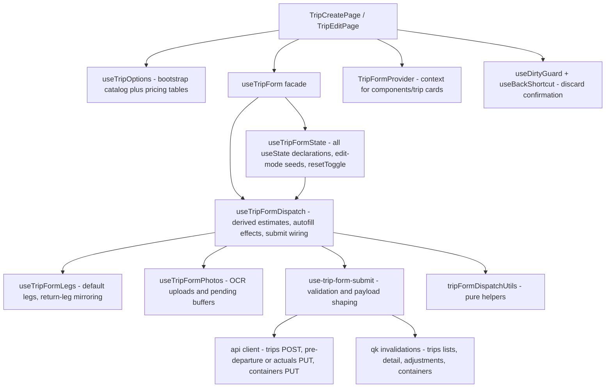

NEPO's frontend keeps its custom hooks under `frontend/src/hooks/`. They fall
into four families: the auth/token context (`useAuth`), the TanStack Query data
layer (per-domain `*Queries` hooks plus the shared `qk` key registry in
`api/keys.ts`), the trip-form family (`useTripForm` and its state/dispatch/
submit/legs/photos satellites), and UI/animation utilities. The actual list
evolves; consult `ls frontend/src/hooks/` for ground truth.

## Auth state and token handling

`useAuth.tsx` exports the `AuthProvider` + `useAuth()` pair (a single file by
design — splitting the hook from its provider is explicitly rejected). The
context value is `{ user, login, logout, updateUser, isAuthenticated, loading,
sessionExpired }`, where `user: AuthUser | null` carries `userId`, `role`,
`capabilities`, and the deployment-level `botEnabled` flag. `App.tsx` mounts
`AuthProvider` around the whole route tree and `Layout.tsx` reads it for the
identity/role UI.

Key behaviors:

- **JWT expiry is evaluated client-side without a library.** `isTokenExpired`
  base64-decodes the token payload and treats it as expired when
  `exp * 1000 < Date.now()` (malformed → expired). `fetchAuthUser` clears the
  stored token and returns `null` when there is no token or it has expired.
- **Token storage has a single source: `design-system/hooks/useToken`.** It
  owns the `localStorage['token']` key behind `getToken` / `setToken` /
  `clearToken` / `invalidateTokenCache`, with an in-memory cache so reads are
  O(1). Both `useAuth` and `lib/api/client.ts` (which attaches the
  `Authorization` header) go through it, which makes a future HttpOnly-cookie
  or refresh-token migration a one-file change.
- **The session user is TanStack-cached, not effect-fetched.** It lives under
  `qk.auth.me` with `staleTime: 5 * 60 * 1000`, `refetchOnWindowFocus: false`,
  `retry: false`. `login` seeds the cache from the `POST /auth/login` response;
  `updateUser` patches it locally.
- **Account switching isolates caches.** `clearSessionData` cancels the in-flight
  auth query, removes every query whose key does not start with `'auth'`, and
  clears the mutation cache, so a late response from the previous account can
  never repopulate the next session. A rejected `/auth/me` only clears the token
  if the rejected token is still the current one (`getToken() === token`).
  `useAuth.test.tsx` covers exactly these races.
- **Logout is idempotent** (short-circuits when the cached user is already
  `null`) and also disposes the agent socket and forgets the resumed assistant
  conversation so a stale token is never reused.
- **Session expiry is an event, not a form error.** The HTTP client's
  `handleSessionExpiry` fires on a 401 whose token is still current: it clears
  the token and calls `notifySessionExpired()`. `AuthProvider` subscribes via
  `onSessionExpired` (the framework-agnostic listener registry in
  `lib/api/session.ts`), sets `sessionExpired: true`, and logs out. 401s from
  unauthenticated calls (bad credentials) stay ordinary request errors.

## React Query data layer

### The shared query-key registry: `api/keys.ts`

Every query key is minted by the `qk` factory. The registry exists because the
codebase previously had 170+ raw key strings across 40 files, two duplicate keys
for the same data, and mutation invalidations that drifted from read keys.
Conventions:

- Each domain gets an object with broad prefixes (`all`, `*All`) used for
  invalidation, plus parameterized `list(...)` / `detail(id)` accessors. Keys
  are hierarchical, so `invalidateQueries({ queryKey: qk.trips.all })` matches
  every trips-prefixed query.
- Keys are frozen `as const` tuples (type-narrowed, DevTools-serializable).
- Detail ids are normalized to strings (`qk.trips.detail` does
  `['trip', String(id)]`) because TanStack matches keys by deep equality and
  `['trip', 68] !== ['trip', '68']` once silently defeated the 409 retry path.
- `allCatalogKeys` lists every catalog-shaped prefix, guarded at compile time so
  a new `qk.catalogs.*` key cannot be added without extending it.
  `invalidateAllCatalogs(qc)` invalidates all of them plus `qk.configCounts.all`
  in one shot — this is what `useCRUD` calls after config writes so dispatch,
  the trip form, and search dropdowns all refresh together.

### Domain query hooks

| Hook file | Responsibility | Notes / typical callers |
|---|---|---|
| `useCatalogs.ts` | The bootstrap catalog blob (`customers`, `routes`, `trucks`, `drivers`, …) under `qk.catalogs.all` | `staleTime` 5 min; `TripEditPage`, `useTripFormDispatch` |
| `useTripOptions.ts` | Shapes bootstrap + pricing tables into the `TripOptions` consumed by the trip form | `TripCreatePage` |
| `useTripQueries.ts` | `useTripDetail`, adjustments, monthly/costs lists (bounded by the resolved salary period) | Trip detail/finance pages |
| `useFinancialQueries.ts` | Customer aging/statements/balances, payables summary, commission + driver-payout mutations | `FinancePage`, `DebtListPage`, `DebtDetailPage` |
| `useForwarderQueries.ts` | Forwarder portal: trips, trip detail, advance requests, settlements, expenses | Forwarder pages |
| `useSalaryQueries.ts` | Salary lists, per-driver salary/work-days, period default config; mutations invalidate the matching salary keys | `SalaryAttendancePage`, `SalaryPeriodConfigPage` |
| `useTireQueries.ts` | Tire inventory + lifecycle (create/update/delete/install) | `TruckTiresPage`, fleet cards |
| `useDriverQueries.ts` | Driver portal: own trips, earnings, penalties, vehicle alerts | `DriverTripsPage`, `DriverEarningsPage`, `DriverPenaltyPage` |
| `useCatalogQueries.ts` | Catalog singletons (cap table, fuel/road config, company info, ports…) + `useSalaryPeriod` | Config pages, finance pages |
| `useNotificationQueries.ts` | Unread count (`refetchInterval` 60 s), paginated + infinite lists, mark-read mutations | `NotificationBell` |
| `useDashboardQueries.ts` | Dashboard stats, monthly/yearly P&L, renewal reminders | `DashboardPage`, `FinancePage` |
| `useChatbotMetrics.ts` | Admin chatbot metrics (summary, latency, tools, timeseries) | `ChatbotMonitoringPage` |
| `useVehicleSchedules.ts` | Active/history vehicle-service schedules + CRUD mutations | `FleetPage`, `DashboardPage` |
| `useAppSettings.ts` / `useGpsSettings.ts` / `useLlmSettings.ts` | Admin singletons; saving app settings also invalidates `qk.auth.me` (botEnabled), GPS settings invalidate `qk.liveFleet.all` | `config/AppSettingsConfigPage` |
| `useAuditLogs.ts` | Infinite-query audit log with category/search filters | `AuditLogPage` |
| `usePenalties.ts` | Penalty rows for the discipline page, bounded by a rolling `dateFrom` window | `PenaltyPage` |
| `useQueries.ts` | Barrel file re-exporting the domain query modules for pages | Import convenience only |
| `useCRUD.ts` | **Deprecated** generic CRUD factory for the remaining `<CrudTable>` config pages; every write ends in `invalidateAllCatalogs` | Slated for removal with the CrudTable factory migration |

## The trip-form hook family

The trip form (create + edit) is decomposed into five cooperating layers.
`useTripForm.ts` is a thin facade: it composes the layers and flattens them
into the ~70-field `UseTripFormReturn` the page and context consume.

*Trip-form hook composition: the `useTripForm` facade flattens the state and
dispatch layers; the submit hook shapes payloads, persists through the api
client, and invalidates `qk` caches.*

### Layer by layer

- **`useTripForm.ts`** — accepts either `TripOptions` (create shorthand) or
  `{ options, mode: 'edit', existingTrip }`, then composes
  `useTripFormState` + `useTripFormDispatch` and maps their fields 1:1 onto the
  flat return object. It owns no state itself.
- **`useTripFormState.ts`** — the state container (extracted during the M3
  decomposition, task T3.1.3): every `useState` declaration, seeded from
  `existingTrip` in edit mode. It also owns `resetForm()` / `resetToggle` (the
  409-retry re-population signal) and the row types: `ContainerFormRow` (with a
  `seals[]` sub-list — the legacy scalar `sealNumber` is derived from
  `seals[0]`), `SealFormRow`, `FuelAllocationFormRow`, and `CompletionStatus`.
  Revenue splits default to `""` (never `"0"`) so an untouched combine
  serializes as *not provided* instead of an explicit zero.
- **`useTripFormDispatch.ts`** — derived values and effects. Computes
  `estimatedFuelCost` (flat-rate override → fixed route allowance → per-leg
  loaded/empty norms), `estimatedTollCost` (road config with edit-mode applied
  values), `estimatedProfit`, the required-field counter and per-section
  `completionStatus`, and `hasOptionalData`. Effects: edit-mode repopulation
  guarded by a `lastPopulatedTripId` ref (plus `resetToggle` so a 409 refetch
  re-syncs), truck→trailer autofill, pricing query → revenue-split seeding,
  route change → tolls/fuel/driver-salary defaults, driver-salary computation
  from the driver's base salary and trip days, and OCR result broadcast
  (`OcrSignal` with a `nonce` so consumers detect fresh results). It wires
  legs, photos, persisted container type, and the submit hook together.
- **`useTripFormLegs.ts`** — seeds legs from the selected route
  (`defaultLegs`, or by splitting the route name into outbound + return).
  The pure `applyLegUpdate` helper auto-generates a mirrored return leg in
  create mode and keeps return-leg fields linked to leg 1 only while they still
  mirror it — once the user customizes a field it becomes authoritative.
  Deleting the return leg sets `hasDeletedReturnLeg` so it is not regenerated.
- **`useTripFormPhotos.ts`** — the photo upload state machine. `uploadPhotos`
  routes CONTAINER/SEAL through `POST /ocr` (recognizes numbers, persists when
  a trip id exists) and OTHER through `POST /upload`. Create-mode and
  not-yet-saved-row photos are buffered in RAM (`blob:` previews) and flushed
  later: `flushPendingPhotos(tripId)` after trip creation, and
  `flushPendingContainerPhotos` via `POST /ocr/persist-only` (recognition
  already ran) once `saveContainers` assigns server ids. Tracks per-zone
  `UploadingState`; `isAnyUploading` is the submit/disable check.
- **`use-trip-form-submit.ts`** — the pipeline. `handleSubmit` performs
  imperative validation (compulsory fields per carrier type; legs; fuel
  supplement reason; per-allocation liters > 0 with ≤ 2 decimals and a
  supplier for CREDIT rows; no half-filled seal rows). Note: validation is
  plain field checks — the frontend has **no Zod dependency**; shared Zod
  schemas remain a backend concern. Then it shapes payloads:
  - *Edit mode*: PUT `/trips/:id/pre-departure` (status `CREATED`) or
    `/trips/:id/actuals`, carrying `existingTrip.version` for optimistic
    concurrency, through `saveTripFiguresOnce` — which on a 409 refetches the
    trip detail and rethrows without retrying the stale payload. After the
    figures commit it reconciles containers and upserts instructions
    (best-effort: a failure surfaces an error and keeps the manager on the
    page, but never rolls back the committed figures).
  - *Create mode*: POST `/trips` first, then flush buffered photos, then — only
    if `hasOptionalData` — the pre-departure PUT, then containers. The created
    id is retained in a ref together with a JSON fingerprint of the planning
    fields: a retry after a rejected follow-up reuses the id (no second POST),
    and if the plan itself changed the hook refuses and tells the user to
    restore the original values. Instructions are skipped (the create page has
    no instructions card). Success returns the trip id; cache updates invalidate
    `qk.trips.all` and write the refetched detail.
- **`tripFormDispatchUtils.ts`** — pure, separately tested helpers:
  `requiredTripFieldProgress` (carrier-conditional: OWN counts
  truck/trailer/driver; EXTERNAL counts partner + freight cost, and the
  external plate is deliberately *not* required at planning — it is required at
  completion), `resolveContainerCount` (clamps 1–10),
  `resolveCommonContainerTypeId`, and `createFallbackLegsFromRouteName`.
- **`useTripFormContext.tsx`** — `TripFormProvider` + `useTripFormContext`.
  Both trip pages wrap the whole form in the provider so deeply nested cards
  under `components/trip/` (`TripInfoCard`, `JourneyLegsCard`,
  `FuelTollsRevenueCard`, `ContainerInstancesCard`, `TotalsPanel`, `ActionBar`,
  …) read and dispatch without prop drilling. The consumer throws outside a
  provider.
- **`usePersistedContainerType.ts`** — edit-mode only: fetches the trip's
  persisted container rows, clears the planned-type selector while the next
  trip loads (so the previous trip's choice never leaks), derives the common
  persisted type via `resolveCommonContainerTypeId`, and refetches when
  `resetToggle` bumps after a 409 reload.
- **`useDirtyGuard.ts`** — the "has anything changed?" signal. It JSON-
  snapshots the provided `deps` values; the first observation after `ready`
  becomes the clean **baseline** (so edit-mode asynchronous population is not
  mistaken for an edit), `markClean()` re-baselines after a save, and the
  stable `isDirty()` getter reads at event time. Pages wire it into
  `useBackShortcut` with the shared `useConfirm` discard dialog;
  `TripEditPage` gates `ready` on a `formHydrated` flag that flips one render
  after the population effect.

## UI helper hooks

| Hook | Responsibility |
|---|---|
| `useClickOutside.ts` | Click-outside + optional Escape dismissal; registers with `lib/overlayState` so ESC-back yields while the overlay is open |
| `useBackShortcut.ts` | Binds Escape to the page's back action with layering: open overlay consumes ESC first, editable targets keep native ESC, then dirty → `confirmDiscard` before navigating |
| `useMonth.tsx` | `MonthProvider`/`useMonth` selected-month context for dashboard/P&L period filters (mounted at the app root) |
| `usePrefersReducedMotion.ts` | `ReducedMotionProvider` at the app root shares one `matchMedia` listener across every consumer |
| `useMediaQuery.ts` | Per-component reactive CSS media query (breakpoint-driven rendering) |
| `useFocusDeepLink.ts` | Scrolls to and highlights `?focus=<id>` targets, then strips the param (agent `focus` directives) |
| `useFocusTrap.ts` | Traps Tab focus inside a container for modals/dialogs |
| `usePersistedContainerType.ts` | Trip-form hook that hydrates the planned container type from persisted container rows (see trip-form section) |
| `useSyncedState.ts` | "Uncontrolled-after-touch" state: re-syncs from an external value until the user edits, `markSynced()` re-enables syncing (used around 409 reseeds); `useDerivedState` for read-only mirrors |
| `usePushNotifications.ts` | Service-worker push subscription with VAPID key handling and device-type sniffing |
| `useAgentOpenable.ts` | Registers a per-page directive handler by `componentId` so the assistant can open/prefill page forms; directives stashed before mount are replayed |
| `useAgentChat.ts` | Drives one SSE agent conversation: folds stream events into messages, tool-activity indicator, streaming bubble, and directives (page-changing ones queue until `RUN_FINISHED`); follows the AG-UI event taxonomy |
| `useBottomNavAnimations.ts`, `useSidebarAnimations.ts`, `useTopbarEntrance.ts`, `useAnimatedOverlay.ts` | Chrome animation hooks (see below) |

## Animation hooks

`hooks/animations/` exports the anime.js v4 primitives — `usePageAnimations`,
`useListAnimations`, `useCounterAnimation`, `useMotionPath`, and
`usePressAnimation`. Shared rules for all animation hooks (top-level ones
included): respect `usePrefersReducedMotion`, and clean up through an anime.js
`createScope().revert()` on unmount. `TripCreatePage` uses `usePageAnimations`
with the `.tc-create-hero` / `.tc-create-bento` selectors, triggered once form
options finish loading (`ready: !options.loading`).

## Conventions

- **Tests colocate with hooks.** `useAuth.test.tsx`, `useTripFormLegs.test.ts`,
  `use-trip-form-submit.test.ts`, `useAgentChat.test.ts`,
  `useBottomNavAnimations.test.tsx`, `useDirtyGuard.test.ts`,
  `useSyncedState.test.ts`, `usePersistedContainerType.test.tsx`,
  `useTripFormState.test.ts`, `useTripOptions.test.ts`, `useVehicleSchedules.test.tsx`,
  and `tripFormDispatchUtils.test.ts` all live next to their hooks. New hooks
  should add tests in the same folder (see [testing.md](../development/testing.md)).
- **New domain → `qk` first.** Add the key family to `api/keys.ts` (with a broad
  `*All` prefix for invalidation), then write the `use*Queries` wrapper; never
  mint raw key arrays in components. If the domain is catalog-shaped, also
  extend `allCatalogKeys` — the compile-time guard enforces it.

## Where to read more

- API client, token store, formatters — [lib.md](lib.md)
- Pages that consume these hooks — [app.md](app.md)
- Server-side handlers behind the query hooks — [services.md](../backend/services.md)
- Route contracts the hooks call — [api-routes.md](../backend/api-routes.md)
- How the colocated hook tests run — [testing.md](../development/testing.md)
