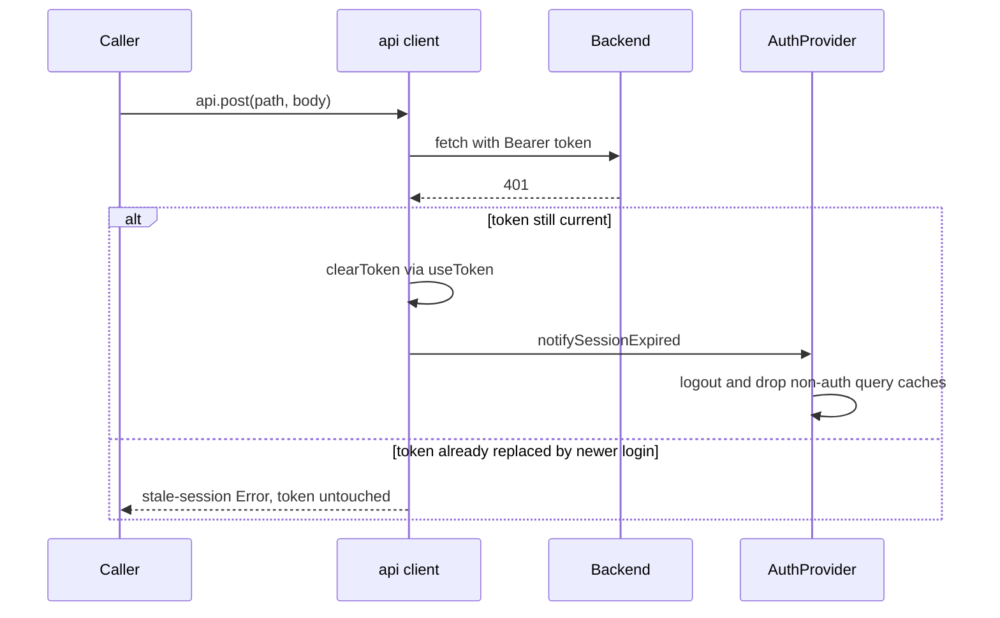

The frontend `src/lib/` folder holds pure helpers shared by pages, hooks, and
feature components. Two structural rules hold across the folder:

- **Math is delegated to `@tingting/shared`** wherever backend and frontend
  compute the same number, so both sides stay byte-identical.
- **`lib/api` is transport-only.** Domain endpoint knowledge lives in
  `src/api/*Client.ts`; the client knows nothing about trips, trucks, or Zod.

## API client (`lib/api/`)

There is no single `lib/api.ts` file. The module is a folder whose `index.ts`
barrel re-exports the public surface (`api`, `ApiError`,
`formatErrorMessage`, `getAuthenticatedPhotoUrl`) so the ~46 existing
`import { api } from '../lib/api'` call sites keep working.

### Transport (`client.ts`)

`client.ts` is a thin wrapper around `fetch` for the REST API:

- Base URL is `import.meta.env.VITE_API_BASE`, defaulting to `/api`.
- **Token storage is delegated to
  `design-system/hooks/useToken`** — the only place that touches the
  `localStorage['token']` key (with an in-memory cache;
  `refreshTokenFromStorage()` invalidates it). `api.setToken` /
  `api.clearToken` forward to it, and the constructor hydrates the cache
  eagerly so `getToken()` is O(1) afterwards.
- Every request sends `Content-Type: application/json` (skipped for
  multipart uploads so the browser sets the boundary) and
  `Authorization: Bearer <token>` when a token exists.
- `api.get/post/put/patch/delete` cover JSON; `getForText`, `getBlob`,
  `postForBlob`, `postForText` cover report/document downloads and
  `upload(url, formData)` covers multipart POST.

### Optimistic-concurrency support

`post` and `put` accept `opts.expectedUpdatedAt`; when present the client
sends it as an `If-Unmodified-Since` header (transport-level plumbing for
conditional writes). The trip-figure saves that motivated it
(`tripClient.updateTripPreDeparture` / `updateTripActuals` →
`PUT /trips/:id/pre-departure` / `/actuals`) enforce the conflict check on
the server through the request body's `version` field instead:
`updateTripFigures` compares it to the trip's stored version and rejects a
stale write with `409 Dữ liệu đã bị thay đổi bởi người khác`, which trip
save flows retry deliberately.

### Session-expiry semantics

The client treats a rejected token as an application-state transition, not a
form error, and guards against cross-account cache pollution:

- A **401 on a request that carried a token** clears the token immediately and
  calls `notifySessionExpired()` (from `api/session.ts`, a framework-agnostic
  listener set). `AuthProvider` subscribes via `onSessionExpired`, sets its
  `sessionExpired` flag, and runs `logout()` — which cancels/removes all
  non-auth TanStack Query caches so nothing from the dead session is reused.
- A **401 without a token** (bad login credentials) stays an ordinary
  `ApiError`.
- Before every response is surfaced (success or error), `assertCurrentSession`
  compares the token the request used against the current token. If they
  differ — a late response from an old session after a new login — the client
  throws `Phiên đăng nhập đã thay đổi. Vui lòng tải lại dữ liệu.` instead of
  feeding another account's data into the current query cache. Writes are
  never retried automatically: the server may already have applied them.



Session-expiry behavior is covered end-to-end in `frontend/src/lib/api.test.ts`.

### Error mapping (`errors.ts`)

`ApiError` carries the HTTP status, the raw response body, and a
user-facing message already translated to Vietnamese. `formatErrorMessage`
understands the backend's error body shapes (Zod issue array under
`details`, plain string, or structured object) and joins translated issues
with `; `. Translation uses two maps: `FIELD_VI` (field path → Vietnamese
label, e.g. `legs.km` → `Số km`) and `MSG_VI` (Zod messages, e.g.
`Required` → `Trường bắt buộc`). Numeric indices in Zod paths are stripped
for the label lookup but surface as a `Chặng N — ` prefix so users see which
trip leg failed. Adding a field is one line in `FIELD_VI`.

### Photo URLs (`photo.ts`)

`` tags cannot send `Authorization` headers, so
`getAuthenticatedPhotoUrl` appends `?token=…` to `/api/photos/…` URLs, and
`photoSrc` additionally accepts bare storage keys (encoding them into a
single path segment for the wildcard photo route). The JWT-in-URL tradeoff
(leaks into nginx logs, history, Referer) is documented in the file as a
known limitation with the fix deliberately localized to one file.

## `lib/http/` — pagination helpers

### `fetchAllPaginated` (`paginate.ts`)

The backend's shared `parsePagination` caps `limit` at 100, so any list can
exceed one page. `fetchAllPaginated<T>(endpoint, params?, concurrency = 5)`
walks a server-paginated endpoint:

1. Fetches page 1 with `limit: 100` and reads `total` to compute
   `totalPages`.
2. Fetches pages `2..N` in batches of `concurrency` (default 5) parallel
   requests via `Promise.all`.
3. Concatenates `items` in page order and returns a flat array. The `total`
   count is intentionally dropped — callers display the whole list anyway.

**Failure semantics: one failed page rejects the whole list**
(`Promise.all` semantics), so callers retry rather than render an incomplete
catalog with incorrect totals. `paginate.test.ts` pins both the
fail-the-whole-list behavior and order preservation under concurrent
fetching.

`configClient` uses it for nearly every catalog list (trucks, drivers,
routes, customers, suppliers, ports, tire positions, pricing tables, …).

<!-- openwiki: mermaid parse failed and this diagram was converted to a text fence so it does not break rendering. Fix the diagram source and restore the mermaid fence. Parser error: Heuristic: an unescaped angle bracket inside a label breaks rendering; rephrase the label. -->
```text
flowchart TD
    A["fetchAllPaginated(endpoint, params)"] --> B["GET page 1 with limit=100"]
    B --> C{"totalPages <= 1?"}
    C -- "yes" --> D["return first page items"]
    C -- "no" --> E["pages 2..N fetched in batches of 5"]
    E --> F{"any page rejected?"}
    F -- "yes" --> G["reject the whole list"]
    F -- "no" --> H["concatenate items in page order"]
```

Auto-pagination of a server-capped list endpoint (page size 100, concurrency 5)

### `toQuery` (`query.ts`)

Builds a query string from a record, skipping `null`, `undefined`, and
empty-string values so callers can spread optional filters without guarding
each key. Numbers and booleans are stringified; the result carries a leading
`?` (or is empty). Every `api/*Client.ts` composes URLs with
`shared` path constants + `toQuery`.

## Formatters (`format.ts`)

Vietnamese-locale formatters used everywhere:

- `formatNumber(n)` — `vi-VN` locale, `.` thousands separator; `null`/NaN →
  `—`.
- `formatCompact(n)` — abbreviates ≥1B to `tỷ`, ≥1M to `tr`, ≥1K to `k`
  (one decimal, trailing `.0` stripped).
- `formatCurrency(n)` — `"12.500.000 ₫"` (integer, ₫ suffix, no decimals;
  `null` → `— ₫`).
- `moneyParts(amount, compact)` — splits a VND amount into
  `{ num, unit, format }` so the unit (`₫`, or `tr ₫` / `tỷ ₫` / `k ₫` when
  compact) renders at subtitle size next to the digits. `format` is a live
  formatter matching the chosen scale for counter animations that write only
  the numeric part. The shared `<Money>` component is built on it (as are the
  debt/payables hero counters, which keep the manual split because counters
  write `textContent` directly).
- `formatDate` / `formatDateTimeVN` — the latter forces
  `timeZone: 'Asia/Ho_Chi_Minh'` explicitly: a `vi-VN` locale argument alone
  only shapes numbers, not the zone, so GPS "last seen" and other device
  timestamps must go through it to read as Vietnam wall-clock on any host.
- `removeDiacritics(str)` — NFD strip + `đ/Đ` mapping for search matching.

Money input parsing lives in `frontend/src/lib/moneyInput.ts`
(`normalizeMoneyInput`, `formatMoneyInput`, `moneyInputToNumber`; tests in
`moneyInput.test.ts`): digits only, so Vietnamese `.` is always a thousands
separator, and blank input stays `undefined` for fallback semantics.

## Date (`date.ts`)

- `formatDayMonth(iso)` — `DD/MM`.
- `formatRelativeTime(iso)` — `Vừa xong`, `5 phút trước`, `2 giờ trước`,
  `Hôm qua`, `3 ngày trước`, then a `DD/MM` date after a week.

That is the whole file — the old month-name/week-start helpers are gone.

## Round (`round.ts`)

Re-export shim — `frontend/src/lib/round.ts` is literally:

```ts
export { round2dp } from "@tingting/shared";
```

This exists so pages can `import { round2dp } from '@/lib/round'` without
importing from the shared package directly. The math lives in
[`@tingting/shared/calculations/round`](../../../../shared/src/calculations/round.ts)
— the canonical example of the byte-identical rule above.

## Routing (`routes.ts`) and route-name parsing (`route.ts`)

`routes.ts` is the frontend projection of the shared page catalog
(`PAGE_CATALOG` in `@tingting/shared`), which is the single source of truth
for every path string and page title:

- `routes` exposes static paths as string constants and parametric paths as
  functions (`routes.tripDetail(id)`), so calling them without the param is
  a compile error.
- `titleForPath(pathname)` walks the hand-ordered `titleRules` array — the
  order *is* the precedence logic (e.g. `/trips/:id` vs `/trips/:id/edit`,
  specific config sub-paths before the `Cấu hình` catch-all) — and falls
  back to `BRAND.name`. Only the title *strings* come from the catalog,
  killing copy-paste drift.
- `homeForRole(role)` resolves the post-login/404 home (driver →
  `myTrips`, forwarder → `myForwarderTrips`, else `dashboard`).
- `absoluteUrl(path)` builds a shareable `https://host/path` from the
  browser origin; call from handlers, not module top level.
- `routes.legacy` keeps the accept-and-redirect shims (`/routes`,
  `/trucks`, …) outside the catalog, and RBAC deliberately stays out of this
  module — `App.tsx` guards + Casbin remain the authority.

`routes.test.ts` is the regression net: a golden table asserting every
representative pathname resolves to the same Vietnamese title as before the
catalog refactor, plus a runtime mirror of the compile-time
catalog ↔ `AGENT_ROUTE_KEYS` parity assertion (35 keys).

`route.ts` is separate and tiny: `splitRoute(name)` splits
`"Hà Nội → Hải Phòng"` into `{ from, to }`, trying the separators
`→`, `⇒`, `->`, `' - '`, `' – '`, `>` in order and returning `null` when no
separator yields two non-empty halves. The dispatch map card, trip mobile
cards, and trip columns use it to render origin/destination pairs.

## Maps (`maps.ts`)

Typed wrappers over the backend `/maps` endpoints:

- `fetchPlaceSuggestions(input, sessionToken?)` — hits
  `/maps/autocomplete` (minimum 2 characters, optional Places session token)
  behind an in-memory cache: 50 entries, 5-minute TTL, oldest-evicted.
  Network errors degrade to `[]` — never throw into the autocomplete UI.
- `calculateRoute(origin, destination)` — hits `/maps/distance`, normalizes
  the backend shape (`{ routes, selected }` with `km`/`polylinePath` mirrored
  on `selected`) and degrades to an all-null result on any failure.
- `decodePolyline(encoded)` — Google-encoded-polyline decoder used by the
  Leaflet route drawing and by `liveRoute.ts`.

On the backend, `backend/src/services/maps.service.ts` serves both routes:
distances now come from real GPS-captured route polylines (not Google
Directions, which was retired), and place autocomplete comes from the
place-search module in `backend/src/services/map4d.ts` (Google Places
Autocomplete (New) primary with a Geocoding fallback), fronted by Redis
caching.

## Live fleet (`liveFleet.ts`) and live route (`liveRoute.ts`)

Neither file is an API client — they hold the geometry and rendering logic
shared by the dispatch map and the trip-detail tracking card:

- `liveFleet.ts` exports `LIVE_STATUS_COLOR` / `LIVE_STATUS_LABEL`
  (moving / stopped / offline), `liveMarkerIcon(status, angle)` — a Leaflet
  `DivIcon` dot with a heading arrow when moving — and `escapeHtml`, used for
  every GPS-sourced string interpolated into popup/tooltip HTML (Leaflet
  renders `html` via `innerHTML`, and vendor address/driver fields arrive
  unescaped).
- `liveRoute.ts` computes what the truck still has to drive:
  `computeRemainingRoute(lat, lng, heading, legs)` projects the position onto
  each leg polyline, keeps candidates within ~2× the nearest leg's distance
  (GPS jitter, merging roads), and breaks the đi/về tie — a round trip
  retraces the same road — with the GPS heading vs. the closest segment's
  bearing. The chosen leg's `loadingType` labels đi (HANG) vs về (VO). It
  returns the destination point, the remaining path from the projection, and
  a true haversine `distanceKm`.
- The data itself is polled by the `useLiveFleet` hook (10-second
  `refetchInterval`) via `tripClient.getLiveFleet()` → `/trips/live-fleet`;
  `LiveFleetMap` redraws markers each refresh and refits bounds only when
  the truck set changes.

## Cap-table dedup (`cap-table.ts`)

`getActiveCapTable(entries)` resolves the ownership snapshot to display:
filter to the latest `effectiveDate` reached today (falling back to all rows
when none is reached yet), dedupe to the most-recent `createdAt` per partner
name, and compute percentages from `contributionAmount` (2-decimal rounding)
— percentages are derived, never stored. When contributions sum to zero it
falls back to the stored `percentage` field.

## CSV / XLSX export (`csv.ts`)

`downloadCSV(filename, headers, rows, options)` builds a brand-styled XLSX
via `exceljs`:

- `DownloadOptions`: `title`, `subtitle`, `columnTypes`
  (text / number / km / liters / currency / date / decimal),
  `totalsColumns`, `totalsLabel` (default `TỔNG CỘNG`), `hideTotals`.
- Layout: emerald title band (3 rows), frozen header row, zebra data rows,
  optional totals row; landscape print setup with fit-to-width.
- Column types are honored explicitly or inferred from headers + sample
  values; a `.csv` filename is silently renamed to `.xlsx`.

## UI-state helpers

### Overlay state (`overlayState.ts`)

A module-level registry answering "is any overlay open?" so the ESC
"go-back" shortcut (`useBackShortcut`) can yield and let the overlay consume
Escape instead of navigating. Two detection layers:

- A count incremented/decremented by overlay hooks — `useAnimatedOverlay`
  (Modal/Drawer/ConfirmDialog), `useClickOutside` with `escapeKey`, and
  `PhotoViewer` register while visible.
- A DOM fallback querying any portal'd `[role="dialog"]` /
  `[role="alertdialog"]`, catching overlays that don't use those hooks.

The count is clamped at 0 and decremented on effect cleanup (next tick), so
the ESC press that *closes* an overlay still sees it open — exactly the
desired peel-one-layer-per-ESC behavior. `overlayState.test.ts` covers the
toggle, the clamp, and the DOM fallback.

### Tour targets (`tourTarget.ts`) and agent highlight (`agentHighlight.ts`)

`resolveTourTarget(targetId)` finds a spotlight anchor by `data-tour-id`
first (with CSS-attribute escaping), falling back to `getElementById` — so
legacy stable ids and new tour attributes both resolve. `agentHighlight.ts`
uses it for the agent-directive bridge: `highlightElement` scrolls the
target into view and runs a Driver.js spotlight, returning `false` when no
element matched so the agent can acknowledge honestly. `tourTarget.test.ts`
pins the precedence, escaping, and null cases.

## Chunk-failure self-heal (`chunk-error.ts`)

After a deploy, an open tab can reference hashed JS chunks that no longer
exist. `installChunkErrorHandler()` (called in `main.tsx` before React
mounts) listens for `error` / `unhandledrejection` events whose messages
match chunk-load failure patterns, purges all service-worker caches, and
reloads once. The reload is capped at one per browser session
(`sessionStorage` counter); a second failure renders a Vietnamese
"Phiên bản mới đã sẵn sàng" fallback instead of looping. Route-level lazy
chunks are normally caught earlier by the `App.tsx` ErrorBoundary — this is
the safety net for eager imports and rejections outside React's tree.

## Other lib utilities

| File | Responsibility |
| --- | --- |
| `audit-helpers.ts` | `ACTION_LABELS`, `resolveCategory`, and `formatTimeShort` — shared rendering inputs for the audit log page/widget. |
| `calendar-month.ts` | `getCalendarMonthRange(year, month)` — inclusive Gregorian month bounds (`YYYY-MM-01` … last day), used by ops/expense views rather than the salary cycle; leap-year coverage in tests. |
| `profit-preview.ts` | `getProfitPreviewEmptyMessage` — picks the correct Vietnamese empty-state string for a profit-distribution preview (no locked trips vs. unconfigurable ownership vs. no data). |
| `expense-breakdown.ts` | `groupExpensesByType` / `groupExpensesByContainer` — per-category and per-container totals with Vietnamese fallback labels; containers sorted chronologically so screen and print agree. |
| `status-variants.ts` | Maps `AdvanceRequestStatus` / `AdvanceSettlementStatus` to the `neutral/info/warn/success/danger` variant tokens used by status chips. |
| `notificationClient.ts` | Typed client for the notifications API — list, unread count, mark-read — plus web-push subscription management (VAPID key, subscribe, unsubscribe). |
| `emptyIllustrations.ts` | Maps empty-state categories (`trips/fleet/ops/finance`) and legacy svg names to the four on-brand PNG illustrations. |
| `utils.ts` | Just `cn(...)` — class-name joining. The old `sleep`/`groupBy`/`uniqBy` helpers no longer live here. |

## Where to read more

- Shared math — [shared/calculations.md](../shared/calculations.md)
- Hooks (token, live-fleet polling, overlays) — [frontend/hooks.md](hooks.md)
- Domain API clients — [backend/api-routes.md](../backend/api-routes.md)
- Pages that use these helpers — [frontend/app.md](app.md)
