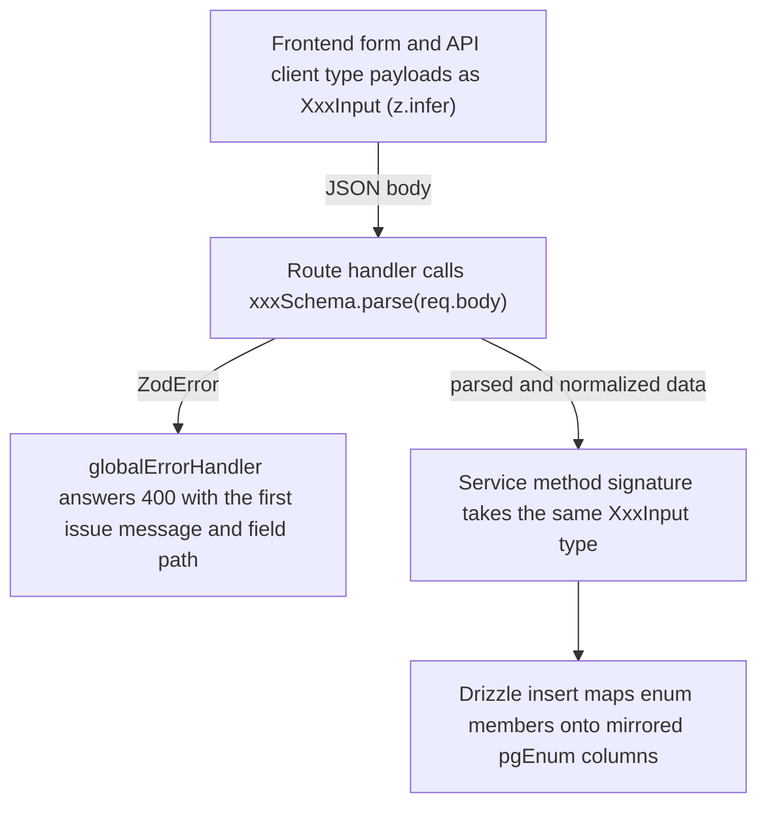

`@tingting/shared` is the contract layer between the frontend and the backend.
Everything crosses the wire through it:

- **`shared/src/constants/index.ts`** — TS enums, Vietnamese `*_LABELS` display
  maps, helper constants, and (via `constants/api-paths.ts`) the HTTP path
  constants for every endpoint.
- **`shared/src/schemas/index.ts`** — Zod schemas for every API request body,
  plus the re-exported `z.infer` input types. It re-exports the agent protocol
  (`schemas/agent.ts`), chatbot metrics (`chatbot-metrics.ts`), LLM settings
  (`llm-settings.ts`), and FAQ admin (`faq.ts`) sub-barrels.
- **`shared/src/types/index.ts`** — hand-written interfaces for *response*
  shapes (`Trip`, `LedgerEntry`, `User`…); the schemas in `schemas/` mirror
  them for *input* shapes.
- **`shared/src/navigation/pageCatalog.ts`** — `PAGE_CATALOG`, the single
  source of SPA page metadata (path, Vietnamese title, `agent` search data).

The package root `shared/src/index.ts` is the only import surface: backend
routes, services, and frontend clients all import from `@tingting/shared`.

## Enums and label maps (`shared/src/constants/index.ts`)

Every enum lives in `constants/index.ts`. UI-facing enums have a paired
`*_LABELS: Record<Enum, string>` map with canonical Vietnamese text, so the UI
never hardcodes display strings — and TypeScript forces the map to stay total
when a member is added. `TRIP_STATUS_COLORS` (plus
`DATA_COMPLETENESS_COLORS`, `TRIP_TODAY_ROW_COLORS`,
`TRIP_MISSING_FIELD_ROW_COLORS`) are the single source of truth for trip
status rendering colors.

| Enum | Members | Paired label map |
|---|---|---|
| `TripStatus` | `CREATED, IN_TRANSIT, COMPLETED, LOCKED, CANCELED` | `TRIP_STATUS_LABELS`, `TRIP_STATUS_COLORS` |
| `FuelMode` | `AUTO, FLAT_RATE` | `FUEL_MODE_LABELS` |
| `LoadingType` | `HANG, VO` | `LOADING_TYPE_LABELS` |
| `Role` | `ADMIN, MANAGER, ACCOUNTANT, DRIVER, FORWARDER` | `ROLE_LABELS` |
| `TxnType` | 16 ledger entry types: `TRIP_REVENUE, PAYMENT_RECEIVED, PENALTY, MANAGEMENT_FEE, ADJUSTMENT, DRIVER_SALARY, VENDOR_EXPENSE, VENDOR_PAYMENT, FORWARDER_ADVANCE, FORWARDER_SETTLEMENT, EXTERNAL_CARRIER_COST, FUEL_EXPENSE, UNLOCK_REVERSAL, COMMISSION, DRIVER_PAYOUT, SERVICE_FEE` | (none — used directly in ledger math) |
| `TrailerType` | keys `FT20`/`FT40` with values `'20FT'`/`'40FT'` | `TRAILER_TYPE_LABELS` |
| `TruckStatus`, `TrailerStatus` | `ACTIVE, MAINTENANCE, INACTIVE` | `TRAILER_STATUS_LABELS` (trucks have no shared map — the config page keeps a local one) |
| `DriverStatus` | `ACTIVE, INACTIVE` | (none) |
| `CustomerStatus` | `ACTIVE, LOCKED` | (none) |
| `PenaltyStatus` | `ACTIVE, CANCELED` | `PENALTY_STATUS_LABELS` |
| `VehicleComponent` | `TRUCK, TRAILER` | `VEHICLE_COMPONENT_LABELS` |
| `VehicleScheduleKind` | `MAINTENANCE, INSPECTION, INSURANCE, ROAD_FEE, DOCUMENT, OTHER` | `VEHICLE_SCHEDULE_KIND_LABELS` |
| `VehicleScheduleStatus` | `ACTIVE, COMPLETED, CANCELLED` | `VEHICLE_SCHEDULE_STATUS_LABELS` |
| Tire status | `TIRE_STATUSES = ['IN_STOCK','IN_USE','DISPOSED'] as const` + derived `type TireStatus` (a tuple, not an `enum`) | `TIRE_STATUS_LABELS`, plus `TIRE_DISPOSAL_REASONS` (Vietnamese reason list for disposal) |
| `AdvanceRequestStatus` | `PENDING, APPROVED, REJECTED` | `ADVANCE_REQUEST_STATUS_LABELS` |
| `AdvanceSettlementStatus` | `PENDING, CHECKED_BY_ACCOUNTANT, APPROVED, REJECTED` | `ADVANCE_SETTLEMENT_STATUS_LABELS` |
| `ExpenseEntryStatus` | `IN_PROGRESS, COMPLETED` | (none) |
| `NotificationType` | 14 event types (`TRIP_CREATED` … `ADVANCE_SETTLEMENT_APPROVED`) | `NOTIFICATION_TYPE_LABELS` |
| `CarrierType` | `OWN, EXTERNAL` | `CARRIER_TYPE_LABELS` |
| `SettlementMethod` | `COMPANY_DIRECT, FORWARDER_ADVANCE` | `SETTLEMENT_METHOD_LABELS` |
| `ApprovalStatus` | `PENDING, APPROVED, REJECTED` | `APPROVAL_STATUS_LABELS` |
| `DebitNoteMode` | `MONTHLY, PER_BATCH` | (none) |
| `TruckCapRole` | `INVESTOR, DRIVER` | `TRUCK_CAP_ROLE_LABELS` (role only labels the partner for UI; the profit-split math is owner-agnostic) |

Enums without a label map (`TxnType`, `DriverStatus`, `CustomerStatus`,
`DebitNoteMode`, `ExpenseEntryStatus`) are internal value sets consumed
directly by logic, not rendered as text.

## Helper constants and API path groups

- `BILLABLE_TRIP_STATUSES = [COMPLETED, LOCKED]` — the trip statuses whose
  revenue/AP has posted to the ledger and are therefore billable on debit
  notes and carrier payment statements. The doc comment is explicit: P&L
  (`pnl.service`) and profit distribution remain **LOCKED-only** by spec and
  must NOT use this set.
- `FINANCIAL_ROLES` / `isFinancialRole()` — `[ADMIN, MANAGER, ACCOUNTANT]`,
  the expense-approval and financial-report group.
- `FORWARDER_EXPENSE_TYPE_DEFAULTS` — 8 seed rows (lifting, lowering,
  weighing, customs, infrastructure, inspection, inspection service, other)
  for the `forwarder_expense_types` config table.
- `PUSH_RULES` — the web-push whitelist: the only `NotificationType` values
  that wake a device, each mapped to an audience (`'driver' | 'financial' |
  'all'`). Absent types stay in-app only. This is the single tuning knob for
  push spam.
- **API path groups** (`constants/api-paths.ts`, re-exported by
  `constants/index.ts`): `AUTH`, `TRIPS`, `TRACKING`, `CATALOGS`, `CONFIG`,
  `TIRES`, `VEHICLE_SCHEDULES`, `FINANCIAL`, `REPORTS`, `DRIVER`,
  `FORWARDER`, `NOTIFICATIONS`, `SYSTEM`, `SALARY`. These are the
  frontend↔backend routing contract: the frontend `ApiClient` prepends `/api`
  and the backend mounts its routers at the same paths. They are **not**
  Casbin resource names — the resources passed to `casbinAuthz()` are
  lowercase strings (`'config'`, `'financial'`, `'trips'`,
  `'driver_portal'`, …) written inline at the mount points in
  `backend/src/index.ts`.
- Agent/admin constants live with their schemas: `AGENT_ROUTE_KEYS` and
  `ACKED_DIRECTIVE_KINDS` in `schemas/agent.ts`;
  `ANCILLARY_EXPENSE_TYPES` in `schemas/index.ts`;
  `CHATBOT_METRICS_PATHS` in `schemas/chatbot-metrics.ts`;
  `LLM_PROVIDERS`, `LLM_PROVIDER_MODELS`, `LLM_PROVIDER_LABELS`,
  `LLM_SETTINGS_PATHS` in `schemas/llm-settings.ts`;
  `GPS_SETTINGS_PATHS` in `schemas/gps-settings.ts`; and `FAQ_ADMIN_PATHS`
  in `schemas/faq.ts`.

## Zod schemas (`shared/src/schemas/index.ts`)

### Numeric and normalization primitives

The barrel opens with reusable primitives because every schema builds on
them:

- `numericMoney` — `z.union([z.number(), z.string()])` that transforms to a
  plain `Number`, rejecting `NaN` with a Vietnamese message
  ('Giá trị tiền tệ không hợp lệ'). Used e.g. for tire cost, where form
  inputs send strings and the column is `numeric`.
- `numericDecimal` — same shape for non-money numerics (message
  'Giá trị số không hợp lệ'); no internal consumer yet.
- Private helpers: `positiveNumeric` / `nonNegNumeric` (coerce + bound),
  `optionalDate` / `optionalText` / `optionalDocumentNumber` (normalize
  `''` → `null` so blank form fields can be submitted as-is), `offsetDateTime`
  (`z.string().datetime({ offset: true })` — rejects locale-ambiguous
  timestamps without an explicit offset), and `booleanish`
  (`'true'/'false'` → boolean, for query params).
- `postgresSerialIdSchema` — coerced positive int capped at
  `2_147_483_647`, keeping ids inside the PostgreSQL `serial` range.

### Domain coverage

- **Trip** — `tripFuelAllocationSchema` (per-purchase pump price, credit
  requires a supplier / cash forbids one, ≤ 10 rows, no counterparty
  uniqueness), `tripLegSchema`, `createTripSchema` (OWN requires
  truckId+driverId; EXTERNAL requires externalCarrierId, plate only at
  completion), `reassignTripSchema`, `updateTripFiguresSchema` (rejects
  sending `revenue` together with `revenueEmptyReturn`/`revenueCombine`
  splits, and company fuel data on EXTERNAL trips), `bulkUpdateTripFiguresSchema`
  (≤ 100 rows, each validated separately by the route).
- **Billing documents** — `generateBillingDocumentSchema` /
  `saveBillingDocumentSchema` (a `DEBIT_NOTE` must target `CUSTOMER`;
  `rangeFrom ≤ rangeTo` with real-calendar-date validation),
  `billingDocumentLineSchema`. Excel-style templates:
  `debitNoteTemplateSchema`, `debitNoteColumnSchema`,
  `debitNoteColumnVariableSchema` (whitelisted variables only), plus the
  `defaultDebitNoteColumns` / `defaultPaymentStatementColumns` seeds.
- **Payment + penalty + adjustment** — `createPaymentSchema`,
  `createPenaltySchema`, `createAdjustmentSchema`.
- **Auth / users** — `loginSchema`, `createUserSchema` (driver-profile
  fields ride along and create the linked `drivers` row),
  `updateUserSchema`, `updateProfileSchema`, `changePasswordSchema`.
- **Catalogs** — `customerSchema`, `truckSchema` (ISO date compliance
  fields), `trailerSchema`, `routeSchema` (+ default legs), `cargoTypeSchema`,
  `pricingTableSchema`, `roadAllowanceSchema`, `fuelConfigSchema`,
  `fuelPriceHistorySchema`, `companyInfoSchema`, `penaltyReasonSchema`,
  `driverSchema`, `managementFeeSchema`, `capTableSchema`,
  `truckCapSchema`, `salaryPeriodSchema`, `salaryPeriodDefaultSchema`.
- **Suppliers + expenses** — `supplierSchema`, `expenseCategorySchema`,
  `expenseSchema`, `vendorPaymentSchema`.
- **Vehicle schedules** — `vehicleScheduleMutationSchema` base with
  `createVehicleScheduleSchema` (remindAt ≤ dueAt),
  `updateVehicleScheduleSchema` (`.partial()`), `vehicleScheduleListQuerySchema`
  (status filter only allowed with `history: true`), `postgresSerialIdSchema`.
- **Trip containers / seals / expenses / instructions** —
  `tripContainerSchema`, `tripContainerBatchSchema` (full-list reconcile,
  seals reconciled by id), `tripContainerPatchSchema` (+`addSeals`),
  `tripContainerSealSchema`, `tripContainerSealBatchSchema`,
  `tripExpenseSchema` (`FORWARDER_ADVANCE` requires `forwarderId`; customs
  requires `declarationNumber`), `baseTripExpenseSchema` (validates against
  `ANCILLARY_EXPENSE_TYPES`), `tripExpensePatchSchema` (explicit null clears,
  undefined leaves unchanged), `tripExpenseCompletionSchema`,
  `accountantSettlementExpensePatchSchema`, `forwarderExpenseTypeSchema`
  (vatRate 0–1).
- **Forwarder flow** — `createAdvanceRequestSchema`,
  `createAdvanceSettlementSchema`, `updateAdvanceSettlementSchema`
  (deduplicated positive-id lists), `upsertTripInstructionsSchema`
  (omitted fields clear to null; phone constrained to dial characters).
- **Tires** — `tireSchema`, `installTireSchema` / `transferTireSchema`
  (exactly one of truckId/trailerId), `disposeTireSchema`,
  `tirePositionSchema`.
- **Commission + payout + offset** — `commissionSchema` and
  `driverPayoutSchema` (amount must be > 0 and ≤ 1 tỷ VND — a backstop
  against typo-scale manual entries), `debtOffsetSchema` (no `amount` — the
  server computes `min(arBalance, apBalance)`).
- **Forwarder catalogs** — `containerTypeSchema`, `portSchema`,
  `sealTypeSchema`.
- **Bách Khoa GPS** — `bachKhoaVehicleSchema`, `bachKhoaResponseSchema`,
  `parseBachKhoaResponse` (see below).
- **Agent / chatbot** and **FAQ** — re-exported from the `agent.ts` and
  `faq.ts` sub-barrels (see below).

## Agent wire protocol (`shared/src/schemas/agent.ts`)

The agent contract is self-contained and consumed by both `@tingting/backend`
(orchestrator) and `@tingting/frontend` (drawer). Three layers, each a
`discriminatedUnion` so consumers switch exhaustively:

- `agentDirectiveSchema` — discriminated on `kind`: `navigate`, `focus`,
  `open`, `prefill`, `toast`, `scrollTo`. This is how the agent drives the UI.
- `agentWidgetSchema` — discriminated on `type`: `kpi_grid`, `bar_chart`,
  `line_chart`, `table`, `callout`, `anomaly_list`. Numeric widget values are
  always raw numbers; `widgetFormatSchema` (`vnd | percent | number | days`)
  drives rendering only — the LLM must never embed pre-formatted strings.
  `provenanceSchema` optionally tags each KPI as `observed / calculated /
  forecast / assumption`.
- `agentResponseSchema` — discriminated on `type`: `text`,
  `insight_card` (title + summary + ≥ 1 widget + optional details), or a bare
  `directive`. All variants may carry `agentCitationSchema` chips
  (`faq | doc | tool`) and `agentActionChipSchema` shortcuts.

### Route keys and the catalog sync guard

`AGENT_ROUTE_KEYS` is the **closed** set of pages the agent may navigate to;
`agentRouteKeySchema = z.enum(AGENT_ROUTE_KEYS)` and the backend validates
the LLM's choice against it. The tuple is hand-written `as const` on purpose:
the `as const` is load-bearing for `z.enum` — deriving it via
`Object.keys().filter()` would widen to `string[]` and break the enum.
Because that would invite drift, a compile-time assertion
(`_agentKeysInSync`) fails `tsc` if `AGENT_ROUTE_KEYS` and the set of
`PAGE_CATALOG` entries carrying an `agent` meta object ever disagree **in
either direction**: an agent-bearing catalog entry missing from the tuple, or
a tuple key whose catalog entry has no `agent` data.

### Streaming, persistence, and acknowledgment

- `agentEventSchema` — the socket.io `/agent` event frames. Event names
  follow the AG-UI protocol taxonomy (`RUN_STARTED`, `TOOL_CALL_START/END`,
  `RUN_FINISHED`, `RUN_ERROR`, `TEXT_MESSAGE_START/CONTENT/END`) plus a typed
  `DIRECTIVE` extension carrying the rich directive payload. Note the
  discriminator is `type`, and its `'directive'` literal is a separate union
  from `AgentResponse.type`'s `'directive'`.
- `ACKED_DIRECTIVE_KINDS = ['navigate', 'focus']` — the only directives with
  a deterministic outcome. The frontend confirms execution through
  `agentActionResultSchema` (`{ actionId, status: ok|error|timeout }`) on the
  `agent:action_result` socket event, so the orchestrator never claims
  success for a directive the client never applied. `open` / `prefill` /
  `toast` / `scrollTo` are fire-and-forget.
- `agentMessageSchema` / `agentConversationSchema` — the persisted
  conversation shapes returned by `GET /conversations[/:id]`.

## Admin sub-barrels

- `schemas/chatbot-metrics.ts` — deliberately **plain TypeScript
  interfaces**, not Zod: the metrics API is a read-only, ADMIN-gated
  aggregation, so response validation is unnecessary. Null-safety contract:
  `percentile_cont`/`AVG` over empty sets return NULL and must never be
  coerced to 0 (0 is a meaningful value). Includes `CHATBOT_METRICS_PATHS`.
- `schemas/llm-settings.ts` — `llmSettingsUpdateSchema` plus provider
  constants. API keys are encrypted at rest and **never returned**: the
  response carries masked previews + `*KeySet` booleans; a PUT omits a key
  field to keep the stored value and uses explicit `clear*Key` booleans to
  wipe one. `LLM_PROVIDER_MODELS` is a hardcoded, read-only model name per
  provider.
- `schemas/gps-settings.ts` — Bách Khoa credentials with the same
  write-only pattern (`passwordSet` + `passwordMasked`; omit password on PUT
  to preserve).
- `schemas/app-settings.ts` — `appSettingsSchema` with the single runtime
  switch `botEnabled`.
- `schemas/faq.ts` — `faqEntryCreateSchema` / `faqEntryUpdateSchema` for the
  chatbot FAQ fast lane. The 1536-dim `embedding` column is intentionally
  absent from all types (it never leaves the server; `hasEmbedding` is a
  computed boolean). `requiredTerms` / `forbiddenTerms` must be stored
  **tone-stripped** (`'phat'`, not `'phạt'`) because the matcher compares
  them against tone-stripped query tokens — the backend tone-strips on save;
  `questionVariants` may keep diacritics. Create/update responses carry
  `embeddingStatus` (`embedded | failed`) so the UI can warn when a save
  could not be embedded.

## External payload parsing: Bách Khoa GPS

`parseBachKhoaResponse` is the defensive boundary for the third-party
GetInfoCar payload (PascalCase fields, sloppy typing). Every field of
`bachKhoaVehicleSchema` has a `.catch()` default so one malformed row never
fails the batch. The vendor returns either an array (success) or a single
error object (`Message` + null fields) — a non-array yields `[]`, and rows
without a plate or with no GPS fix (`0,0`) are dropped.

## The `z.infer` pattern

For every domain the package exports an input type next to the schema:

```ts
export const createTripSchema = z.object({ ... });
export type CreateTripInput = z.infer<typeof createTripSchema>;
```

`AGENTS.md` states the rule: use `z.infer<typeof XxxSchema>` for input types
rather than defining separate interfaces. The round trip:



Diagram: one write payload from form type to database column, with the schema
as the single validation point.

- The backend route handler parses `req.body` with `schema.parse(...)`; a
  `ZodError` is caught by `globalErrorHandler` and becomes a **400** whose
  message is the first issue's text plus its field path.
- The parsed value — with coercions, normalizations, and defaults applied —
  is passed to the service, whose signature uses the same `XxxInput` type.
- The frontend re-imports the identical `XxxInput` for its API clients and
  forms (e.g. `vehicleScheduleClient.ts` typing `create()` with
  `CreateVehicleScheduleInput`). There is no parallel hand-written interface.
- Response shapes stay in `types/index.ts` (`Trip`, `UserWithDriver`,
  `LedgerEntry`, …); code standards require the schemas to mirror them.

## pgEnum mirroring (`backend/src/db/schema.ts`)

Core shared enums are mirrored 1:1 by `pgEnum` declarations at the top of
`db/schema.ts` — same values, same order of intent: `trip_status`,
`fuel_mode`, `loading_type`, `role`, `txn_type`, `trailer_type`,
`truck_status`, `driver_status`, `customer_status`, `trip_photo_type`,
`penalty_status`, `vehicle_component`, `vehicle_schedule_kind`,
`vehicle_schedule_status`, `trailer_status`, `advance_request_status`,
`advance_settlement_status`, `notification_type`. Two pgEnums have **no**
shared-constants counterpart (`work_day_status`
`TRIP_DAY/STANDBY/PERSONAL_LEAVE/WEEKLY_OFF` and
`salary_confirmation_status` `DRAFT/CONFIRMED`) — the backend and frontend
inline those unions instead.

Some enum-like columns deliberately avoid `pgEnum` to dodge enum-migration
hassle: `truck_cap_table.role` is `text` + a CHECK constraint (also avoiding
a name collision with the user-role enum), `customers.debit_note_mode` and
`trips.carrier_type` are `varchar` with defaults, and the old
`forwarder_expense_type` pgEnum was replaced by the `forwarder_expense_types`
config table (`trip_expenses.expense_type` is now a varchar referencing
config codes). When adding a new closed value set, prefer mirroring it as a
pgEnum unless there is a documented reason not to.

## Adding a schema end-to-end

1. **Define** the Zod schema in `shared/src/schemas/index.ts` (or a
   module-specific sub-barrel like `faq.ts` when it is a self-contained
   contract). Use the numeric/normalization primitives; attach business
   rules with `.superRefine`/`.refine`. Pair it with
   `export type XxxInput = z.infer<typeof xxxSchema>`.
2. **Export** it from the barrel (`schemas/index.ts`) and the package root
   (`shared/src/index.ts`) so both apps import it from `@tingting/shared`.
3. **Parse** it in the route handler (`xxxSchema.parse(req.body)`, or
   `safeParse` when the route aggregates its own error list), then hand the
   parsed data to the service typed by `XxxInput`.
4. **Mirror** any new closed value set: TS enum (+ `*_LABELS` map when
   UI-visible) in `shared/src/constants/index.ts`, matching `pgEnum` in
   `db/schema.ts`.
5. **Test** it with a colocated `node:test` file next to the schema. The
   tests that matter pin the non-obvious invariants:
   `vehicleSchedule.test.ts` locks offset-aware timestamp parsing (the
   Vietnam boundary instant), `remindAt ≤ dueAt`, the `history`-default and
   status-filter rule, and the serial-range cap;
   `updateTripFiguresSchema.test.ts` covers the EXTERNAL-trip refinements;
   `fuelActualUnitPrice.test.ts` pins the lossless VND round-trip
   (input → `String()` → `numeric` → `Number()`) against hidden rounding.
   Shared test files run via `tsx` and are intentionally excluded from
   `tsc`; type-check with `pnpm --dir shared typecheck`.

## Where to read more

- Where schemas are consumed — [backend/api-routes.md](../backend/api-routes.md)
- Database columns and pgEnums — [backend/database-schema.md](../backend/database-schema.md)
- Conventions — [development/conventions.md](../development/conventions.md)
- Domain terms behind the enum names — [domain-glossary.md](../domain-glossary.md)
- Financial math the schemas feed — [shared/calculations.md](calculations.md)
