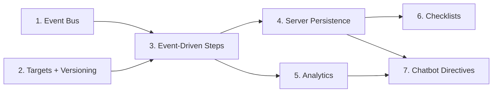

# Onboarding Orchestration Layer: Event-Driven Tours, Server Progress & Role Checklists

## Overview

This plan upgrades an **already-working** Driver.js tour subsystem into a
production-grade, **event-driven onboarding orchestration layer** — without
replacing the renderer, the tour state machine, or the chatbot directive bridge.

### What already exists (verified in code at commit 2026-07-13)

The codebase is *not* starting from scratch. Confirmed present:

| Capability | Where | Evidence |
|---|---|---|
| Driver.js spotlight + popover | `frontend/src/lib/agentHighlight.ts` | `driver.js@^1.6.0` in `frontend/package.json` |
| React tour state machine (start/next/prev/skip/complete/resume) | `frontend/src/context/TourControllerContext.tsx` | `TourControllerValue`, `useReducer`-style via `useState` |
| Curated TS tour registry — **3 tours** | `shared/src/tours/catalog.ts` + `schema.ts` | `create-trip` (4), `lock-trip-and-payment` (4), `fuel-config` (6) |
| Persistent tour chrome | `frontend/src/components/agent/TourController.tsx` | bottom-right card, Prev/Next/Skip/Xong |
| Per-browser progress | `frontend/src/lib/tourProgress.ts` | `localStorage` under `tingting:tour:v1:<id>` (schema-versioned, server-migration-ready by design) |
| Chatbot → tour launch | `useAgentChat` `onStartTour` → `TourControllerContext.start` | `RUN_FINISHED {type:'start_tour'}` |
| 6-kind typed directive protocol | `shared/src/schemas/agent.ts` (`agentDirectiveSchema`) | navigate/focus/open/prefill/toast/scrollTo |
| Backend tour search tool + `start_tour` response + tour-net guardrail | `backend/src/services/agent/tools/tours.ts`, `orchestrator.ts` | role-gated, closed-set |
| Catalog integrity test | `shared/src/tours/catalog.test.ts` | routeKey + role + step-count checks |

### What is genuinely missing (this plan's scope)

1. **No event-driven completion.** Steps advance only on the Next button — the
   tour cannot detect that the user *actually* created the trip or locked it.
2. **No tour versioning.** `Tour` has no `version` field; a catalog edit silently
   invalidates in-flight/resumed progress.
3. **No missing-target recovery UX.** `sendAndWait` polls 1.8 s then surfaces
   `highlight-missed` text; no skip-with-explanation, no telemetry.
4. **No server persistence.** Progress is localStorage-only (multi-device-unsafe,
   no admin visibility, no cross-device resume). `tourProgress.ts` line 1 comment
   explicitly anticipates this migration.
5. **No analytics.** Nothing is recorded for tour start / step viewed /
   target-missing / completion / abandonment. `ChatBotHLD.md` §14.4 lists
   tutorial analytics as a gap.
6. **No role-based activation checklist.** Onboarding is ad-hoc from chat only;
   no first-login checklist, no business-event-driven completion.
7. **Chatbot tour control is `start_tour` only.** No `continue`/`cancel`
   directives; the model cannot resume or stop a tour it started.

### Architectural direction (matches the brief + `ChatBotHLD.md` §10, §18)

> Driver.js stays as the renderer. A typed event-driven state machine stays as the
> brain. **Server-side Postgres** becomes the progress source of truth. **Business
> events** become completion signals. **The chatbot stays a safe tour selector** —
> it never emits selectors or JavaScript.

Scope decision (locked with user): **Focused MVP** — the 7 phases below. Deferred
to a follow-up plan (Stage 5 of the brief): contextual triggers (first-use,
error-driven, repeated-friction) and the full onboarding analytics dashboard. An
animated hand pointer is explicitly **out of scope** (Driver.js popover is
sufficient for this stage).

## Phases

| Phase | Name | Status |
|-------|------|--------|
| 1 | [Foundation: Typed Product-Event Bus](./phase-01-foundation-event-bus.md) | Completed |
| 2 | [Semantic Tour Targets & Tour Versioning](./phase-02-semantic-targets-tour-versioning.md) | Completed |
| 3 | [Event-Driven Step Model & Missing-Target Recovery](./phase-03-event-driven-step-model-missing-target-recovery.md) | Completed |
| 4 | [Server-Side Onboarding Progress & Task Persistence](./phase-04-server-side-onboarding-progress-task-persistence.md) | Completed |
| 5 | [Onboarding Lifecycle Analytics Capture](./phase-05-onboarding-lifecycle-analytics-capture.md) | Completed |
| 6 | [Role-Based Onboarding Checklists](./phase-06-role-based-onboarding-checklists.md) | Completed |
| 7 | [Typed Chatbot Tour Directives & Safe Registry](./phase-07-typed-chatbot-tour-directives-safe-registry.md) | Completed |

## Phase Dependency Graph

- **Phase 1 + 2 are independent foundations** — can be developed in parallel.
- **Phase 3 depends on both** (event bus + versioned targets).
- **Phases 4 and 5 both consume Phase 3** and are independent of each other.
- **Phases 6 and 7 both depend on Phase 4** (server persistence); Phase 7 also
  benefits from Phase 5 (analytics) but is not hard-blocked by it.

## Key Design Decisions (locked)

| # | Decision | Rationale |
|---|---|---|
| D1 | **Extend `AgentTutorialStep`, do not replace it** with a 5-way discriminated union | The shared step type is used by *both* curated tours *and* freeform LLM `tutorial` responses (documented "hybrid" decision in `schema.ts:13-16`). Adding an optional `completionEvent?: ProductEventName` preserves that; a union would break the orchestrator's tutorial synthesis. |
| D2 | **Frontend typed event bus** (`onboardingEvents.emit/waitFor`), not backend verification | Locked with user. Reusable for future analytics; no per-tour server round-trips; matches the brief's §3. Emitters live at existing API success call sites. |
| D3 | **Support both `id` and `data-tour-id`** for targets; do not migrate existing stable `id`s | Existing `id`s (`trip-new-submit`, `fuel-save-config-button`, …) are already stable and tested. `data-tour-id` becomes the convention for *new* targets and for elements whose `id` is generated/dynamic. |
| D4 | **2 tables**: `user_onboarding_progress` (per tour-version) + `user_onboarding_tasks` (checklist items). localStorage becomes a read-through cache. | Matches the brief's §7 schema and the `tourProgress.ts` line-1 migration note. Unique on `(user_id, tour_id, tour_version)` makes version bumps safe. |
| D5 | **Chatbot directives stay closed-set & typed.** Add `continue_tour` / `cancel_tour` response kinds mirroring `start_tour`. The model still **cannot** emit selectors, JS, or invent tour contents — the tour net + role validation enforce curated-only. | This is the brief's §10 safety boundary and the existing A3 guardrail pattern. |
| D6 | **No new vendor, no state-machine library.** `useReducer` + the event bus suffice. | Project YAGNI/KISS ethos; `ChatBotHLD.md` §10.3 and §18 agree. |

## Domain & Conventions (non-negotiable, from `CONTEXT.md` + `AGENTS.md`)

- **All user-facing tour text is Vietnamese** (₫ currency, no decimals).
- **Role-gated**: tours/checklists are scoped by `Role` enum (ADMIN, MANAGER,
  ACCOUNTANT get onboarding; DRIVER/FORWARDER do not — matches the chatbot gate).
- **Shared package is the single source** for tour catalog, event names, and task
  IDs — backend and frontend import from `@tingting/shared`.
- **Drizzle + pgEnum** for new status fields; migrations via `pnpm db:generate`.
- **Audit**: new onboarding mutation endpoints pass through the existing
  `audit.ts` middleware (Vietnamese audit messages).

## Dependencies

### Cross-plan coordination (not blocking — orthogonal surfaces)

- **`plans/2026-07-13-fast-response-chatbot-lanes/`** (intent router, latency
  reduction) touches the **orchestrator's request pipeline**; this plan touches
  the **final-answer synthesis + response types**. They share `orchestrator.ts`.
  Coordination rule: Phase 7's new response kinds (`continue_tour`/`cancel_tour`)
  must be added to the same `AgentResponse` union that the intent-router plan
  may branch on. **No file-level conflict** if Phase 7 lands first; the router
  plan's `intent_bucket` classification should treat `*_tour` responses as a
  distinct bucket. Flag in both plans.
- **`ChatBotHLD.md`** is the architectural source-of-truth doc; this plan
  implements its §10 (tutorials/onboarding) and parts of §14.4 (analytics gaps).
  No edit to the HLD is required by this plan, but Phase 7 should add an ADR or a
  section update noting the new directive kinds.

### New dependencies introduced

- **None.** All work uses existing stack (React 19 context, Drizzle, Postgres,
  driver.js, Socket.IO). No new npm packages.

## Testing Strategy

- **Shared**: extend `shared/src/tours/catalog.test.ts` with version + completion-
  event assertions; add `shared/src/onboarding/events.catalog.test.ts` for the
  event-name closed set.
- **Backend**: integration tests under `backend/src/tests/` for the new
  `/api/onboarding` routes (progress upsert, task completion, role gating) and
  the new chatbot response-kind validation.
- **Frontend**: Vitest tests for the event bus (`waitFor` timeout/resolve), the
  target resolver, and the reducer state transitions; a tour-flow integration test
  using the existing testing pattern.
- Manual QA in staging per project memory (`test all changes in staging`).

## Risk Assessment (top 3)

| Risk | Impact | Mitigation |
|---|---|---|
| Event-bus `waitFor` hangs a tour if a business event is never emitted (e.g. user abandons mid-form) | Tour stuck on an interaction step | Every `completionEvent` step **must** keep a manual "Bỏ qua"/Next fallback; timeout (configurable, default 0 = no auto-timeout) only auto-advances on a documented opt-in. |
| Server progress writes on every step create DB load + latency | Laggy tour UX | Phase 4 debounces writes (write-on-step-change, not write-on-render); localStorage stays the immediate cache; server sync is fire-and-forget with retry. |
| Catalog edit invalidates in-flight tours | Users resume a tour whose steps changed | Phase 2 `version` field + unique constraint `(user_id, tour_id, tour_version)`; resumed tours whose version differs surface a "nội dung đã đổi, bắt đầu lại?" prompt. |
